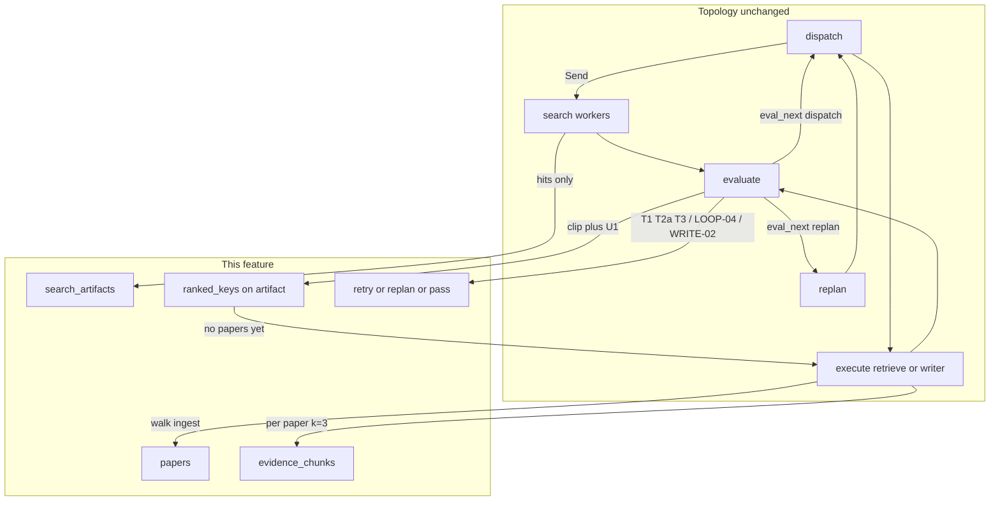

# Admission 1/topic and Per-Paper Retrieve Design

**Spec**: `.specs/features/admission-retrieve-per-topic/spec.md`  
**Routing atlas**: `.specs/features/admission-retrieve-per-topic/graph-flow.md` (grilled; normative edges)  
**Parent design**: `.specs/features/orchestrator-eval-replan/design.md` (approved; topology, SSE names, hybrid RRF, `Send` waves stay)  
**Architecture constraints**: `.specs/features/arxiv-grounded-research/context.md` (PAT-01–PAT-12 still apply)  
**Status**: Approved (2026-08-29)

This feature does **not** add nodes, event names, or a second orchestrator. LangGraph stays `gate → planner → dispatch → search|execute → evaluate → replan|finalize`. What changes is **when a paper is admitted**, **how retrieve builds `[n]`**, and **how attempt-1 vs attempt-2 / T1–T3 route** inside `evaluate` and the retrieve runner.

---

## Architecture Overview

Today a passing search dumps **all** filtered hits into `papers` (`evaluate._evaluate_wave`), and retrieve runs **one** `hybrid.retrieve(query, all_keys, k=Policy.retrieve_k)` with `retrieve_k=8`. This design splits that into three stages:

1. **Search execute** — unchanged I/O: formulate → arXiv `max_results=8` → allowlist + recency → `search_artifacts` only. Still no PDF, still no `papers`.
2. **Search evaluate** — the wave judge returns an **ordered ranking** per step; runtime **clips** to that artifact’s hits and applies **U1** (champion-only uniqueness). Persist `ranked_keys` on the **full** artifact. `passed` iff the list is non-empty. **Do not write `papers`.** Attempt 1 fail **always retries** (ignore `plan_inadequate` for the graph edge).
3. **Retrieve execute** — walk each passed ranking (plan order), admit **at most one usable PDF** (fallback in-execute), `merge_papers` / `max_papers=8`, then **one hybrid call per remaining paper** with `k=3`, slice after ensemble, concat in papers order, continuous `[n]`. Evaluate then applies T1 / T2a / T3. Writer eval adds WRITE-02 (hole rule).



**Research notes (verification chain):**

- **Codebase:** Admission lives in `graph/nodes/evaluate.py` (`admitted.extend(_paper_refs(artifact["hits"]))`). Retrieve is `agents/retrieve.py` ingesting `state.papers` then a **union** hybrid call (`Policy.retrieve_k`). `SearchStepVerdict` has no ranking field (`eval/types.py`). Search already does not write `papers` (`agents/search.py`); API pool is `Policy.max_papers` (coincidentally 8). `plan_inadequate` on search **skips leftover retry** (`_evaluate_wave`). Hybrid adapter already isolates `EnsembleRetriever` (`adapters/hybrid.py`). Replan prompt is generic REPLAN-02 (`agents/planner.py`). Writer requires at least one real `[n]` (`WriterEvalStrategy._deterministic`).
- **Project docs:** AD-014, spec IDs ADM-01–04 / RETR-02–04 / LOOP-04–05 / REPLAN-03 / WRITE-02, graph-flow.md diagrams 4–8. No `.specs/codebase/CONCERNS.md`. Fragile spots unchanged: `dict_row`, Windows event loop, `ChatOpenAI` `api_key`, `eval_next` must stay on `GraphState`.
- **LangChain hybrid:** Same `EnsembleRetriever` RRF 0.7/0.3 as the parent design. Per-paper means **N adapter calls** with `paper_keys` of length 1, not a new fusion. Slice `[:3]` after `ainvoke` because ensemble length is not a hard contract.
- **Structured output:** Extend `SearchStepVerdict` with nested `list[PaperKey]`. Same `json_schema` path as today’s wave judgement. Clip is **runtime**, never trust the LLM’s IDs.

---

## Code Reuse Analysis

### Existing Components to Leverage

| Component | Location | How to Use |
| --------- | -------- | ---------- |
| Graph topology | `graph/build.py`, `dispatch.py`, `search.py` worker | **No new nodes.** Search `step_end.paper_ids` stay **filtered hits**. |
| Search runner | `agents/search.py` | Keep formulate + filter + artifacts-only. Switch API pool to `Policy.search_max_results` (8). Do not pick a champion. |
| Search wave judge | `eval/strategies.py` `SearchEvalStrategy` | Keep **one** LLM call + deterministic empty/allowlist/recency notes. Add ranking to the schema and checklist. Clip + U1 are **not** the LLM’s job. |
| Evaluate wave / step | `graph/nodes/evaluate.py` | Stop writing `papers` from hits. Apply clip+U1; persist `ranked_keys`. Change search fail routing (LOOP-04). Branch retrieve on `retrieve_ingest` (T1/T2a/T3 + LOOP-05). |
| Retrieve runner | `agents/retrieve.py` | Replace “ingest `state.papers` + union k” with ranking walk + per-paper hybrid. Reuse splitter 500/100, `load_pdf_text`, upsert, formulate. |
| Hybrid adapter | `adapters/hybrid.py` | **Reuse signature.** Runner loops `retrieve(query, [one_key], k=3)`. Empty keys still `[]`. |
| `merge_papers` | `graph/state.py` | Unchanged FIFO unique-by-`(arxiv_id, version)` trim. Retrieve **simulates** this before hybrid so chunks match checkpointed `papers`. |
| Replan node | `graph/nodes/replan.py` | Unchanged packing (`prefix + suffix`, SSE suffix only, zero `retry_counts`). Constraints go into `PlannerRunner.replan_remaining`. |
| Writer runner + ORCH-03 | `agents/writer.py`, `WriterEvalStrategy` | Keep deterministic `[n]` + no extra URLs. Add hole context to the prompt and the language/tone checklist (WRITE-02). |
| Policy | `policy.py` | Add `retrieve_k_per_paper`, `search_max_results`, `HOLE_RULE`. Stop using `retrieve_k` as the retrieve contract. |
| Registry | `agents/registry.py` | Abilities text only (1/topic, ranking at eval, per-paper k, hole rule). Same `PLAN_AGENTS`. |
| SSE mapper / Chainlit | `api/sse.py`, `ui/` | No new event **names**. Additive `eval` fields already exist. |

### Integration Points

| System | Integration Method |
| ------ | ------------------ |
| LangGraph | Same reducers. New overwrite key `retrieve_ingest` (no reducer). Evaluate writes `search_artifacts` patches (full artifact including `hits` + `query_used` + `ranked_keys`). Retrieve writes `papers` only after ingest. |
| pgvector | Same `get_paper` / `upsert` / `list_chunks`. Walk uses cache hit to skip PDF. T3 retry does **not** re-walk. |
| SSE | Same names. Search `paper_ids` = hits; retrieve `paper_ids` = newly admitted refs this execute (existing `execute.py` reads `update["papers"]`). |
| Checkpointer | `.get()`-default `retrieve_ingest` and `ranked_keys` so old `thread_id`s resume. Follow-up still uses thread `papers`. |

No `CONCERNS.md`. Mitigations: keep column-name SQL; do not index `dict_row` by `0`; clip rankings in process, not in the prompt; do not add a third LLM picker.

---

## Components

### Policy (PAT-10)

- **Purpose**: Single copy of caps, retrieve floor, search pool, hole wording.
- **Location**: `src/plan_based_researcher/policy.py`
- **Interfaces**:
  - `Policy.search_max_results: int = 8` — arXiv API pool (ADM-02). **Not** `max_papers` (admission cap). Search runner must use this, never `1`.
  - `Policy.retrieve_k_per_paper: int = 3` — per-paper hybrid k and post-ensemble slice (RETR-02).
  - Remove **use** of `Policy.retrieve_k` (delete the attribute so nothing can call the old union contract by accident).
  - `Policy.HOLE_RULE` — absence sentence needs no `[n]`; technical claims about a topic need chunks from **that** topic’s paper; no parametric fill; do not cite another method’s chunks as the missing topic.
  - `Policy.max_papers`, hybrid weights, splitter, retries, replans — unchanged.
- **Dependencies**: none
- **Reuses**: existing `is_allowlisted` / `within_recency` / `GROUNDING_RULE`

### PaperKey + SearchStepVerdict (ADM-03, SEARCH-02 shape)

- **Purpose**: Wave judge returns acceptable keys; runtime owns clip, U1, and `passed`.
- **Location**: `src/plan_based_researcher/eval/types.py`
- **Interfaces**:

```python
class PaperKey(BaseModel):
    arxiv_id: str
    version: str = ""

class SearchStepVerdict(BaseModel):
    step_index: int
    passed: bool
    plan_inadequate: bool = False
    feedback: str
    ranked_keys: list[PaperKey] = []
```

- Judge `passed` / `ranked_keys` are **inputs** to admission, not the final artifact. After clip + U1, runtime sets `passed = len(ranked_keys) > 0` (empty list cannot pass, even if the judge said `passed=true`).
- Deterministic empty / none-allowlisted / none-in-recency: force **empty** ranking before U1 (`passed` cannot be true) but **still include** the step in the one LLM call so `plan_inadequate` can be set for S8a later.
- **Dependencies**: pydantic structured output (`json_schema`), same as today
- **Reuses**: `SearchWaveJudgement.verdicts`

### Admission helpers (ADM-03, ADM-04)

- **Purpose**: Pure clip + U1 so evaluate stays a router, not a pile of nested loops.
- **Location**: `src/plan_based_researcher/eval/admission.py` (**new**)
- **Interfaces**:
  - `hit_key(hit) -> tuple[str, str]` — `(arxiv_id, str(version))`
  - `clip_ranked_keys(ranked: list[PaperKey], hits: list[dict]) -> list[PaperKey]` — keep keys present in **this** artifact’s hits, preserve judge order, drop hallucinations. If `version` is empty, bind to the unique hit with that `arxiv_id` when exactly one exists; otherwise drop.
  - `champion_keys(artifacts, passed_steps, plan) -> set[tuple[str, str]]` — ranking **head** of every **passed** search artifact already on the plan (`ranked_keys[0]`). Papers may still be empty.
  - `apply_u1(ranked, assigned: set[tuple[str, str]]) -> list[PaperKey]` — drop keys already in `assigned`.
  - `finalize_wave_rankings(wave, plan, artifacts, passed_steps, judgement) -> list[FinalSearchVerdict]` — process **in plan order**: clip → U1 against `assigned` → if non-empty: `passed=true`, persist list, `assigned.add(head only)` (not the whole fallback list). If empty: `passed=false` (do not mark passed). Copy `plan_inadequate` + `feedback` from the judge (or deterministic notes).
- **Dependencies**: artifacts + wave judgement
- **Reuses**: none (new). Do **not** put this inside `SearchRunner`.

`assigned` seed = champions of passed searches **not in this wave** (prefix / prior wave). Then each passing step in this wave adds **only its head**.

### SearchEvalStrategy (ADM-03)

- **Purpose**: One structured wave call; titles + abstracts vs **this** task.
- **Location**: `eval/strategies.py`
- **Interfaces**:
  - Checklist asks for an **ordered** `ranked_keys` of acceptable `(arxiv_id, version)` for that step (not “admit all hits”).
  - `_merge_wave_verdicts`: on deterministic fail, force `passed=False` and `ranked_keys=[]`; still keep judge `plan_inadequate` / `feedback`.
  - Does **not** apply U1 (evaluate calls `finalize_wave_rankings` after `evaluate_wave`).
- **Dependencies**: `PaperKey` schema on the bound LLM
- **Reuses**: existing `_search_wave_indices`, `_search_deterministic`, one `ainvoke`

### Evaluate node — search wave (ADM-01–04, LOOP-04, REPLAN-03)

- **Purpose**: Persist rankings, never admit PDFs, retry attempt 1 always.
- **Location**: `graph/nodes/evaluate.py` `_evaluate_wave`
- **Interfaces**:
  - **Stop** `admitted.extend(_paper_refs(hits))` / `update["papers"]` on search pass.
  - For each `FinalSearchVerdict` with `passed`: append index to `passed_steps`; write `search_artifacts[str(i)] = {**existing, "ranked_keys": [...]}` (must keep `hits` and `query_used`).
  - Fail routing (**LOOP-04**): **never** take `elif verdict.plan_inadequate: need_replan` on search. Always `_retry_status(retry_counts, i)`. Attempt 1 → `eval_next=dispatch` (retry that search, new query, no PDF). Attempt 2 → `need_replan` (existing increment-then-`>` cap). Persist `plan_inadequate` on `eval_by_step` / SSE for S8a; the boolean does **not** pick a graph edge.
  - Mixed wave: if any step is `need_replan`, replan **wins** over retry (existing `_apply_route` order). Passed siblings stay passed with their `ranked_keys`.
- **Dependencies**: `eval/admission.py`, Policy caps
- **Reuses**: `_emit_eval`, `_apply_route`, `eval_next` channel

### Retrieve runner (RETR-02, RETR-03, RETR-04)

- **Purpose**: Admit one usable PDF per ranking, then floor chunks per paper.
- **Location**: `agents/retrieve.py` (walk helpers may be private functions in the same module)
- **Interfaces**:
  - `RetrieveRunner.run(state) -> dict`
  - **T3 retry skip walk:** if `retry_counts[str(retrieve_step_index)] > 0`, do **not** walk rankings (ingest already complete this step). Hybrid the **same** `state.papers`. Do not re-try PDFs found empty on attempt 1.
  - **Follow-up:** if the **current plan** has no passed `agent==search` steps, skip walk; `usable =` unique thread `papers` (cap `max_papers`).
  - **Walk (attempt 1, current plan has passed searches):** `usable` starts as thread `papers`. For each passed search index **in plan order**: for each key in that artifact’s `ranked_keys`: skip if key already in `usable`; else cache `get_paper` or `load_pdf_text` → split 500/100 → embed → upsert; on empty text or empty split, **next key same ranking, same execute** (no extra LLM, no search retry). Stop at **first usable PDF** for that ranking. If the list is exhausted, record a **gap** for that step index. Champion empty ≠ arXiv miss.
  - After walk: `merged = merge_papers(state.papers, newly_admitted)` (same function as the reducer) so FIFO trim is applied **before** hybrid.
  - **T1:** `merged` empty → skip formulate and hybrid; `evidence_chunks=[]`; `retrieve_ingest.case="t1"`.
  - **T2a / T3 / follow-up:** formulate English query (retry adds that step’s `eval_by_step` feedback + previous `retrieve_query_used`). For **each** paper in `merged` order: `chunks_i = hybrid.retrieve(query, [(id, ver)], k=Policy.retrieve_k_per_paper)` then `chunks_i = chunks_i[:Policy.retrieve_k_per_paper]`. Concatenate; number `[n]` from 1 continuously. Tiny PDF may contribute fewer than 3. A paper with zero chunks is omitted from concat (and should not have been usable).
  - **T2a vs T3 after walk:** `case="t2a"` if `gap_step_indices` non-empty and `merged` non-empty; `case="t3"` if no gaps (including follow-up / skip-walk).
  - Return: `evidence_chunks`, `retrieve_query_used` (omit or `""` on T1), `last_agent="retrieve"`, `pgvector` hit/miss as today, `retrieve_ingest`, and `papers` **only** for newly admitted refs this execute (omit key on skip-walk / T3 retry).
- **Dependencies**: `PaperPort`, `ChunkRepository`, `EmbeddingPort`, `HybridRetrievePort`, `merge_papers`
- **Reuses**: ingest loop pieces already in `RetrieveRunner`; hybrid adapter unchanged

Lookup metadata for a new admit from the matching `SearchHit` in that artifact; on cache hit, from the paper record.

### Retrieve eval (RETR-04, LOOP-05)

- **Purpose**: Deterministic T1/T2a; T3 semantic judge; R2 retry rules.
- **Location**: `RetrieveEvalStrategy` + `_evaluate_step` in `evaluate.py`
- **Interfaces**:
  - **T1:** do **not** call the mini-judge. `EvalResult(status="fail", plan_inadequate=True, feedback=...)`. Evaluate uses existing `plan_inadequate` → skip retrieve-query retry → replan if unused else `insufficient`.
  - **T2a:** do **not** wait for the mini-judge. Same `fail` + `plan_inadequate=True` (hybrid already ran on living papers). Do **not** un-pass searches. Skip query retry.
  - **T3 / follow-up:** existing deterministic empty / foreign-chunk checks, then semantic judge vs retrieve `task`. Checklists stay “chunks from admitted keys, match this task”; add that T3 query miss is a retrieve rewrite, not a new PDF walk.
  - **LOOP-05 / R2** in `_evaluate_step` when `agent=="retrieve"` and `retrieve_ingest.case=="t3"`:
    - **Query miss** (empty chunks, foreign chunk, or semantic fail whose chunks are empty/off-task): **attempt 1 always retry**, even if the judge set `plan_inadequate`.
    - **Paper set cannot satisfy** (ingest complete, chunks non-empty, all keys admitted, judge `plan_inadequate=True`, failure is not empty/off-task): skip leftover retry → replan or `insufficient`.
    - Attempt 2 exhausted → replan remaining (usually Writer `task`) or `insufficient`.
- **Dependencies**: `retrieve_ingest` on state
- **Reuses**: `_retry_status`, `_apply_route`; do not copy search LOOP-04 onto retrieve blindly

### Planner + replan constraints (ADM-01, REPLAN-03)

- **Purpose**: 1/topic plans; S8a and T2a/T1 suffix rules without a new enum.
- **Location**: `agents/planner.py`, `agents/registry.py` abilities
- **Interfaces**:
  - Initial prompt: each `search` is **one named topic** (distinct `task` texts on compare). Unchanged shapes: explain / compare / follow-up omit search.
  - `replan_remaining`: inject **trigger-specific** constraints (computed from leftover steps + `eval_by_step` + `retrieve_ingest`), in addition to today’s prefix / papers / leftover blob:
    - **S8a (per leftover search index):** `eval_by_step[i].plan_inadequate == True` → MUST NOT emit a new `search` for that topic (typical suffix `retrieve` + `writer`: compare **evidenced** topics, state the hole, no parametric fill). `False` → MUST emit **one corrected** `search` for that topic (angle / alias / `historical`) then retrieve + writer. Both are remaining-only; graph edge is always `replan`.
    - **Retrieve T2a:** prefer **writer-only** suffix when `evidence_chunks` is non-empty; Writer task: living topics with `[n]`, state **no usable arXiv paper/PDF** for each gapped search task; forbid filling from memory. Dead search stays in prefix `passed_steps`.
    - **Retrieve T1:** MUST NOT emit a new `search` (searches already passed; failure is PDF). Suffix still needs a `writer` or the replan node marks `insufficient`.
    - **Retrieve T3 exhausted:** rewrite remaining, usually Writer `task` (same papers already ingested).
  - Prefix summary: show **champion** (`ranked_keys[0]` title) per passed search, not five raw hits.
- **Dependencies**: `gpt-5.1` structured `ResearchPlan`
- **Reuses**: `replan.py` packing; SSE `plan` = suffix only

New search after S8a `plan_inadequate=false`: U1 at the next search eval still uses champions already stored on **passed** artifacts.

### Writer + WRITE-02

- **Purpose**: Grounded living topics; announce holes; no weights-as-source.
- **Location**: `agents/writer.py`, `WriterEvalStrategy`, registry writer abilities
- **Interfaces**:
  - Derive **living vs missing** from state and pass both into the user prompt:
    - Living: passed searches whose ingested key is in `papers` **and** at least one `evidence_chunks` row has that `(arxiv_id, version)`; list those `[n]`.
    - Missing: leftover failed search **tasks** plus T2a `gap_step_indices` tasks (passed search, no usable PDF).
  - System prompt: `GROUNDING_RULE` + `HOLE_RULE`. Hole language matches the student query; titles/excerpts stay as sourced.
  - A “no usable paper was found for {topic}” sentence is **not** a technical claim and does **not** need `[n]`.
  - `WriterEvalStrategy`: keep ORCH-03 deterministic `[n]` + arxiv.org-only URLs. Language/tone judge **must** receive the living/missing lists and fail on: definitions/mechanisms/comparisons of a missing topic; citing living `[n]` as if they were the missing topic. Retry = rewrite on the **same** `evidence_chunks`.
  - Empty chunks (T1 writer): deterministic no-`[n]` still fails (ORCH-03). That is intended; the run may `insufficient` after the only replan.
- **Dependencies**: plan + artifacts + papers + chunks + `retrieve_ingest`
- **Reuses**: existing `WriterOutput`, citation mapping

### Hybrid adapter

- **Purpose**: Unchanged port; per-paper is the caller’s loop.
- **Location**: `adapters/hybrid.py`
- **Interfaces**: `retrieve(query, paper_keys, k)` as today. No union `LIMIT k` at the retrieve-runner layer. Do not add MMR or scores on `EvidenceChunk`.
- **Reuses**: EnsembleRetriever RRF, `id_key="chunk_id"`

### Search runner (ADM-02)

- **Purpose**: Pool of 8, artifacts only.
- **Location**: `agents/search.py`
- **Interfaces**: `self._papers.search(query, max_results=Policy.search_max_results)`. Still no `papers` in the return dict. Retry still uses that step’s `eval_by_step` + previous `query_used`.
- **Reuses**: formulate + allowlist + recency + dedupe

---

## Data Models

### Search artifact

```python
class RankedKey(TypedDict):
    arxiv_id: str
    version: str

class SearchArtifact(TypedDict):
    step_index: int
    query_used: str
    hits: list[SearchHit]
    ranked_keys: NotRequired[list[RankedKey]]  # after eval pass only
```

**Relationships:** `hits` = filtered API pool. `ranked_keys` = clip + U1 list (fallback order for retrieve). Head is the eval champion; retrieve may ingest a later key if the head PDF is empty. Failed / retried search overwrites the artifact key and drops stale `ranked_keys` (last-write-wins merge of the whole artifact).

### Retrieve ingest report

```python
class RetrieveIngestReport(TypedDict):
    case: Literal["t1", "t2a", "t3"]
    gap_step_indices: list[int]
    walked: bool
```

Overwrite each retrieve execute. Default via `.get()`: `{"case": "t3", "gap_step_indices": [], "walked": False}` so old checkpoints do not crash. Follow-up skip-walk uses `case="t3"`, `walked=False`.

### Graph state (delta)

Add `retrieve_ingest: RetrieveIngestReport`. Keep `eval_next` (existing SPEC_DEVIATION). Do **not** add a new replan enum.

`papers` = thread-usable set **after successful ingest** (and FIFO trim). Search eval never writes it.

### Control flow (normative delta)

```text
search evaluate (after one wave LLM + clip + U1):
  pass → ranked_keys on artifact; passed_steps += i; no papers
  fail → always _retry_status
        attempt 1 → dispatch (retry search; ignore plan_inadequate for the edge)
        attempt 2 → replan if unused else insufficient
                  (S8a reads eval_by_step[i].plan_inadequate per leftover search)

retrieve execute:
  retry_counts[retrieve] > 0 → skip walk, hybrid same papers, k=3 each
  else if no passed search on current plan → skip walk, hybrid thread papers
  else walk rankings → merge_papers → T1 skip hybrid | else per-paper hybrid

retrieve evaluate:
  T1 / T2a → fail + plan_inadequate; no query retry; replan or insufficient
  T3 query miss attempt 1 → retry query (R2; ignore judge plan_inadequate for the edge)
  T3 paper-set inadequate → skip leftover retry; replan or insufficient
  T3 pass → dispatch writer

writer evaluate:
  ORCH-03 then WRITE-02 hole judge; retry same chunks
```

Routing diagrams remain in `graph-flow.md` (do not fork them here).

---

## Error Handling Strategy

| Error scenario | Handling | User impact |
| -------------- | -------- | ----------- |
| Judge ranking hallucinates IDs | Clip to artifact hits | Step may fail / retry; no bogus `papers` |
| Judge `passed=true` but clip/U1 empty | Runtime fail (not pass) | Search retry / S8a; no silent share of another topic’s paper |
| Two rankings share fallback keys | U1 reserves heads only; retrieve skips `usable` | Fallback collision resolved at ingest |
| Champion PDF empty | Next `ranked_keys` in the same execute | Not a search retry |
| Every fallback PDF empty, others live | T2a: hybrid living; deterministic `plan_inadequate`; writer-only replan | Student gets living `[n]` + “no usable paper” for the hole |
| Every ranking empty and no thread papers | T1: no hybrid, no retrieve retry, replan without new search | Often `insufficient` after Writer cannot ground |
| T3 hybrid empty / off-task attempt 1 | New English query, **same** papers, no PDF re-walk | Extra retrieve `step_*` / `eval` |
| Search attempt 1 empty or off-task | Always retry search; `plan_inadequate` on SSE only | No `plan` SSE yet |
| Search attempt 2 | Remaining replan; S8a per leftover search | Suffix `plan` SSE |
| T2a but `replan_used` | `insufficient` | Living chunks never become `answer_complete` without Writer pass |
| `max_papers` already 8 | FIFO `merge_papers` may drop a newly ingested paper | Hybrid uses post-trim set; still no union `LIMIT k` |
| Writer teaches a missing topic | WRITE-02 fail; retry same chunks | No parametric lecture on first pass |
| Timeout / `max_steps` | Parent CAP-02 | Includes replan-added steps |
| Infra (DB / OpenAI / PDF) | Exception → SSE `error` | Not an eval status |

---

## Tech Decisions (only non-obvious ones)

| Decision | Choice | Rationale |
| -------- | ------ | --------- |
| Ranking field name | `ranked_keys: list[PaperKey]` on verdict **and** artifact | Spec keys are `(arxiv_id, version)`; nested objects clip cleanly; one name across LLM and state |
| Who picks the paper | Wave judge + clip + U1 only | Spec forbids `SearchRunner` picker and a third agent |
| When `papers` is written | Retrieve ingest only | Search pass must not FIFO-fill `max_papers` with eight hits |
| Uniqueness U1 vs retrieve skip | Heads at eval; `usable` skip at ingest | Spec: fallback overlap is an ingest problem; empty after U1 fails **search** |
| API pool vs admission cap | `search_max_results=8` separate from `max_papers` | Same number today; must not collapse if `max_papers` changes; never `top_k=1` |
| Per-paper hybrid | Runner loops existing `HybridRetrievePort` | No new port; N≤8 ensemble builds; matches “one call per paper” |
| Post-ensemble slice | `[:retrieve_k_per_paper]` after each call | Ensemble size is not guaranteed; spec requires at most 3 |
| Search attempt 1 vs `plan_inadequate` | Ignore for **routing** only | LOOP-04; flag still stored for S8a on attempt 2 |
| S8a boolean | Reuse `plan_inadequate`; **per leftover search** in the replan prompt | No new enum; mixed leftover can disagree per topic |
| T1/T2a judge | Skip mini-judge; deterministic `fail` + `plan_inadequate` | Spec: do not wait; existing evaluate path already skips retry on that flag |
| T3 R2 | Query miss retries attempt 1 even if judge `plan_inadequate`; paper-set inadequate does not | Do not copy search-Q2 onto every retrieve fail |
| T3 retry walk | Skip ranking walk when retrieve `retry_counts>0` | Spec: same papers; do not re-walk exhausted PDFs |
| Hole enforcement | Prompt context + writer judge checklist, not a new `EvalResult` status | ORCH-03 stays; WRITE-02 is semantic |
| Graph | No new nodes | Atlas already fits `_after_evaluate` |

---

## Package layout (delta)

```
src/plan_based_researcher/
  eval/admission.py          # new: clip, U1, finalize_wave_rankings
  eval/types.py              # PaperKey + ranked_keys
  eval/strategies.py         # ranking checklist; T1/T2a short-circuit
  graph/nodes/evaluate.py    # no papers on search pass; LOOP-04; LOOP-05
  graph/state.py             # ranked_keys NotRequired; retrieve_ingest
  agents/search.py           # search_max_results
  agents/retrieve.py         # walk + per-paper k=3 + ingest report
  agents/planner.py          # S8a / T1 / T2a / T3 constraints
  agents/writer.py           # living vs missing + HOLE_RULE
  agents/registry.py         # abilities text
  policy.py                  # retrieve_k_per_paper, search_max_results, HOLE_RULE
  adapters/hybrid.py         # no signature change
```

No new graph node files. No new SSE events. Do not add Elasticsearch, MMR, or a picker agent.

---

## Requirement mapping (design coverage)

| ID | Design coverage |
| -- | --------------- |
| ADM-01 | Planner 1/topic abilities; evaluate admits at most the ranking head into **ranked_keys**, not a lot into `papers`; retrieve admits ≤1 usable PDF per ranking |
| ADM-02 | `search_max_results=8`; artifacts only; no API `top_k=1`; search never writes `papers` |
| ADM-03 | `SearchStepVerdict.ranked_keys`; one wave LLM; clip; `passed` iff non-empty after clip+U1; full artifact kept |
| ADM-04 | `eval/admission.py` U1 heads; retrieve skips `usable`; empty after U1 fails that search |
| RETR-02 | `retrieve_k_per_paper=3`; per-paper hybrid; slice; concat; follow-up skip walk |
| RETR-03 | Ranking walk + in-execute fallback; T3 retry skip walk |
| RETR-04 | `retrieve_ingest` T1/T2a/T3; T2a hybrid + deterministic `plan_inadequate`; searches stay passed |
| LOOP-04 | Search fail always `_retry_status`; attempt 1 never routes on `plan_inadequate` |
| LOOP-05 | Retrieve R2 in `_evaluate_step`; T1/T2a skip query retry |
| REPLAN-03 | Planner constraints: S8a per leftover search; T2a writer-only; T1 no new search |
| WRITE-02 | `HOLE_RULE` + living/missing prompt + writer judge; retry same chunks |

**Coverage:** 11/11 spec IDs have a component and data shape.

---

## Out of design (still deferred / parent-locked)

Admitting 2–3 papers per search, API `max_results=1`, picker LLM, MMR / score threshold / global rerank, full-PDF rerank, new SSE names, changing Gate / splitter / hybrid **weights** / Writer `[n]` **format**, un-passing a search because PDF failed, parametric fill, pytest suite (still deferred).

---

## Approved locks (2026-08-29)

User approved spec + design. These are locked for Tasks:

1. **`SearchStepVerdict.ranked_keys: list[PaperKey]`** (`arxiv_id`, `version`) — clip + U1 at runtime; judge IDs never trusted.
2. **`papers` only after retrieve ingest** — search eval writes `ranked_keys` only (supersedes parent “admit on search pass”).
3. **`retrieve_k_per_paper=3`** via N hybrid calls (existing adapter); delete `retrieve_k`; **`search_max_results=8`** distinct from `max_papers`.
4. **`retrieve_ingest` on `GraphState`** for T1/T2a/T3; T3 retrieve retry skips the ranking walk.
5. **LOOP-04 / LOOP-05 routing** as above (search attempt 1 always retry; T3 query miss always retry; T1/T2a and paper-set inadequate skip retrieve retry).
6. **S8a** reuses `plan_inadequate` **per leftover search** in the replan prompt (no new enum).
7. **WRITE-02** via prompt + existing writer judge (no new eval status).
8. **No new LangGraph nodes**; `graph-flow.md` stays the routing atlas.
