# Graph execution flow — admission 1/topic + retrieve per paper

**Status:** Grilled 2026-08-29. Spec + design approved 2026-08-29. Tasks draft: `tasks.md`. Not implemented yet.  
**Parent loop:** `.specs/features/orchestrator-eval-replan/` (nodes and SSE **names** unchanged).  
**This document:** routing atlas for Design — every edge case from that grill, drawn on the **real** LangGraph topology (`gate → planner → dispatch → search|execute → evaluate → replan|finalize`).

Caps (unchanged unless named): `max_steps=8`, `max_retries_per_step=1` (2 attempts), `max_replans=1`, `max_papers=8`, timeout ~2 min (API, not a graph node). New: `retrieve_k_per_paper=3`. API search `max_results=8` (never 1).

Invariants:

- Search never writes `papers`, never loads PDF.
- Evaluate on search **pass** writes `ranked_keys` on the artifact; it does **not** admit papers.
- Retrieve admits at most **one usable PDF per passed search ranking**, walking the ranking; then hybrid **per paper** (`k=3`, slice after ensemble), concat in admission order, continuous `[n]`.
- Passed steps are never re-executed. Gate, Writer grounding `[n]`, SSE event names, splitter 500/100 stay as today.
- **No parametric fill.** If a named topic has no ingested PDF / no chunks, the Writer states that **no usable arXiv paper was found for that topic** and answers **only** what the remaining chunks support, each technical claim with a real `[n]`. It MUST NOT explain the missing topic from model weights, general knowledge, or by citing LoRA/QLoRA chunks as if they were DoRA.

---

## 1. LangGraph topology (actual nodes)

Conditional edges are only `_after_gate` and `_after_evaluate`. Search workers join at `evaluate`. Timeout can abort any hop from the API layer.

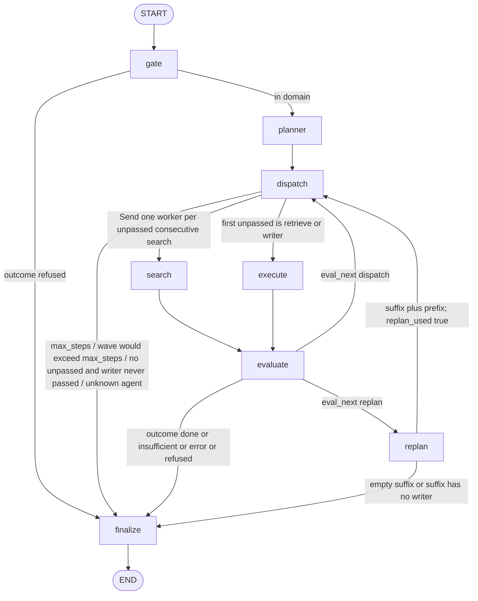
```mermaid
flowchart TB
  START([START]) --> gate
  gate -->|outcome refused| finalize
  gate -->|in domain| planner
  planner --> dispatch

  dispatch -->|Send one worker per unpassed consecutive search| search
  dispatch -->|first unpassed is retrieve or writer| execute
  dispatch -->|max_steps / wave would exceed max_steps / no unpassed and writer never passed / unknown agent| finalize

  search --> evaluate
  execute --> evaluate

  evaluate -->|eval_next dispatch| dispatch
  evaluate -->|eval_next replan| replan
  evaluate -->|outcome done or insufficient or error or refused| finalize

  replan -->|suffix plus prefix; replan_used true| dispatch
  replan -->|empty suffix or suffix has no writer| finalize

  finalize --> END([END])
```

---

## 2. Dispatch — which hop runs next

`search_wave_indices`: from the first **unpassed** index, take a run of `agent==search`. Mixed later passed searches are not in the wave (they stay in `passed_steps`).

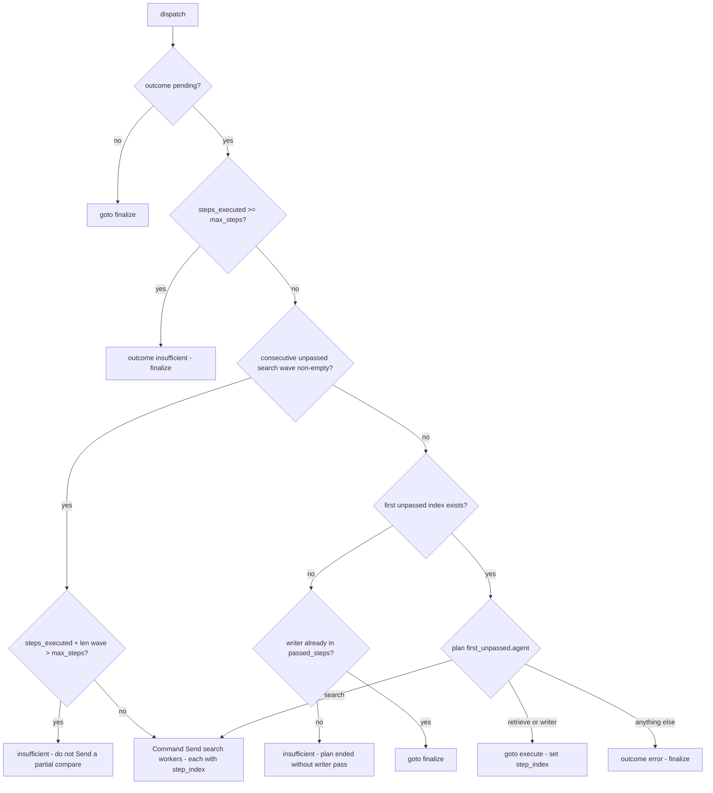
```mermaid
flowchart TB
  D[dispatch] --> O{outcome pending?}
  O -->|no| F1[goto finalize]
  O -->|yes| C1{steps_executed >= max_steps?}
  C1 -->|yes| INS1[outcome insufficient - finalize]
  C1 -->|no| W{consecutive unpassed search wave non-empty?}
  W -->|yes| C2{steps_executed + len wave > max_steps?}
  C2 -->|yes| INS2[insufficient - do not Send a partial compare]
  C2 -->|no| SEND["Command Send search workers - each with step_index"]
  W -->|no| U{first unpassed index exists?}
  U -->|no| WP{writer already in passed_steps?}
  WP -->|no| INS3[insufficient - plan ended without writer pass]
  WP -->|yes| F2[goto finalize]
  U -->|yes| A{plan first_unpassed.agent}
  A -->|retrieve or writer| EX["goto execute - set step_index"]
  A -->|search| SEND
  A -->|anything else| ERR[outcome error - finalize]
```

Follow-up plan `retrieve → writer` (no search): wave empty → execute retrieve. `papers` come from the checkpoint; ranking walk is skipped (no passed **search** steps on the **current** plan).

---

## 3. Search worker — one step, no PDF, no admission

Retry uses **that** step’s `eval_by_step` feedback and previous `query_used`. `step_end.paper_ids` are **filtered hits**, not the champion (ranking does not exist yet).

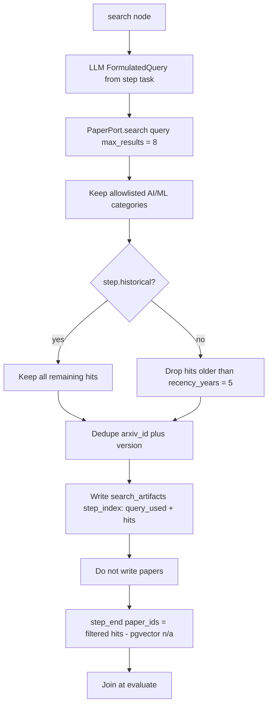
```mermaid
flowchart TB
  SW[search node] --> FQ[LLM FormulatedQuery from step task]
  FQ --> API["PaperPort.search query max_results = 8"]
  API --> FILT[Keep allowlisted AI/ML categories]
  FILT --> REC{step.historical?}
  REC -->|yes| KEEP[Keep all remaining hits]
  REC -->|no| REC2[Drop hits older than recency_years = 5]
  KEEP --> DEDUPE[Dedupe arxiv_id plus version]
  REC2 --> DEDUPE
  DEDUPE --> ART["Write search_artifacts step_index: query_used + hits"]
  ART --> NO[Do not write papers]
  NO --> SSE[step_end paper_ids = filtered hits - pgvector n/a]
  SSE --> JOIN[Join at evaluate]
```

Edge: after filter the list may be empty. That is **not** an arXiv miss of “the topic cannot exist”; it is a deterministic fail for this attempt (see diagram 4).

---

## 4. Search evaluate — one LLM wave, then per-step clip / U1 / retry / replan

One `SearchWaveJudgement` call for the whole wave (retry wave = only still-unpassed searches). Deterministic empty/filter-fail still goes **into** that call so the judge can set `plan_inadequate` for the planner, but **attempt 1 never routes on that flag**.

### 4a. One step (repeat in plan order)

`assigned` = champion keys already taken by **earlier** passed searches this wave **and** champions already stored on **passed** search artifacts (prefix / prior wave). Papers may still be empty (admission is retrieve).

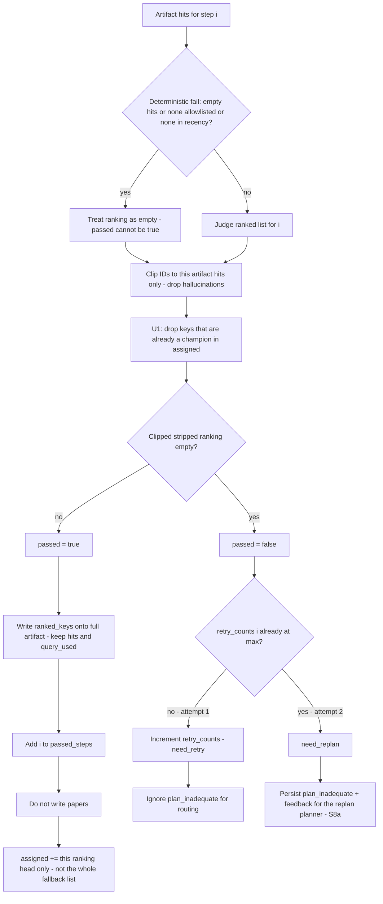
```mermaid
flowchart TB
  HITS[Artifact hits for step i] --> DET{Deterministic fail: empty hits or none allowlisted or none in recency?}
  DET -->|yes| RANK0[Treat ranking as empty - passed cannot be true]
  DET -->|no| JUDGE[Judge ranked list for i]
  RANK0 --> CLIP
  JUDGE --> CLIP[Clip IDs to this artifact hits only - drop hallucinations]
  CLIP --> U1["U1: drop keys that are already a champion in assigned"]
  U1 --> EMPTY{Clipped stripped ranking empty?}
  EMPTY -->|yes| FAIL[passed = false]
  EMPTY -->|no| PASS[passed = true]
  PASS --> WRITE[Write ranked_keys onto full artifact - keep hits and query_used]
  WRITE --> MARK[Add i to passed_steps]
  MARK --> NOPAPER[Do not write papers]
  NOPAPER --> ASSIGN["assigned += this ranking head only - not the whole fallback list"]
  FAIL --> ATT{retry_counts i already at max?}
  ATT -->|no - attempt 1| RETRY[Increment retry_counts - need_retry]
  RETRY --> IGN[Ignore plan_inadequate for routing]
  ATT -->|yes - attempt 2| REPL[need_replan]
  REPL --> KEEP[Persist plan_inadequate + feedback for the replan planner - S8a]
```

### 4b. After every wave verdict — mixed wave

Replan **wins** over retry if any step is on attempt 2. Passed searches in the same wave stay passed; their rankings stay.

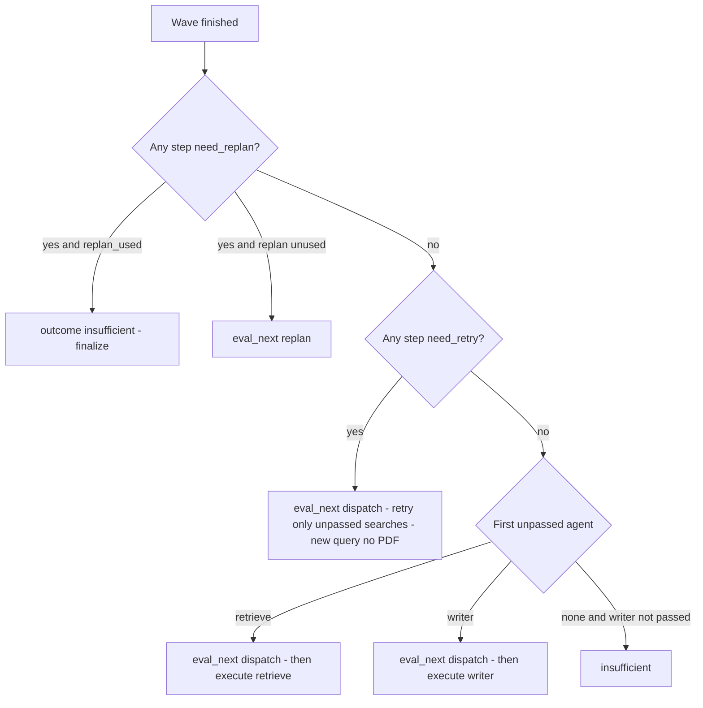
```mermaid
flowchart TB
  ALL[Wave finished] --> ANYRP{Any step need_replan?}
  ANYRP -->|yes and replan_used| INS[outcome insufficient - finalize]
  ANYRP -->|yes and replan unused| RP[eval_next replan]
  ANYRP -->|no| ANYRT{Any step need_retry?}
  ANYRT -->|yes| DIS[eval_next dispatch - retry only unpassed searches - new query no PDF]
  ANYRT -->|no| NEXT{First unpassed agent}
  NEXT -->|retrieve| DIS2[eval_next dispatch - then execute retrieve]
  NEXT -->|writer| DIS3[eval_next dispatch - then execute writer]
  NEXT -->|none and writer not passed| INS2[insufficient]
```

`steps_executed += len(wave)` here (once after join). Emit one SSE `eval` frame per step (`status`, `feedback`, `agent: search`, `step_index`, `plan_inadequate`).

---

## 5. Replan after **search** attempt 2 — S8a

Both branches are `eval_next = replan`. The boolean does **not** pick a graph edge. Prefix = passed steps (kept). SSE `plan` = **suffix only**.

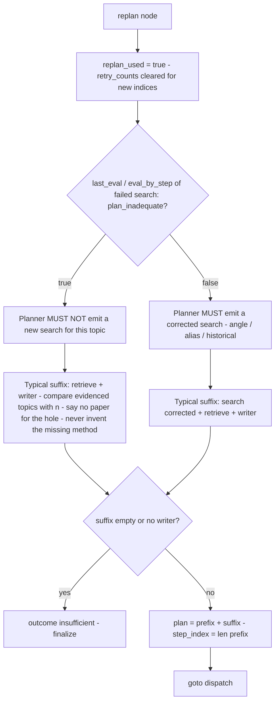
```mermaid
flowchart TB
  RE[replan node] --> USED[replan_used = true - retry_counts cleared for new indices]
  USED --> FLAG{last_eval / eval_by_step of failed search: plan_inadequate?}
  FLAG -->|true| NOS["Planner MUST NOT emit a new search for this topic"]
  NOS --> GAP[Typical suffix: retrieve + writer - compare evidenced topics with n - say no paper for the hole - never invent the missing method]
  FLAG -->|false| YES["Planner MUST emit a corrected search - angle / alias / historical"]
  YES --> SFX[Typical suffix: search corrected + retrieve + writer]
  GAP --> VAL{suffix empty or no writer?}
  SFX --> VAL
  VAL -->|yes| INS[outcome insufficient - finalize]
  VAL -->|no| PLAN[plan = prefix + suffix - step_index = len prefix]
  PLAN --> DISP[goto dispatch]
```

Meaning of `plan_inadequate` on **search attempt 2** (overloaded on purpose, no new enum):

- `true` → topic unrealizable **or** task was fine and two queries failed (do not gamble the only replan on a third search).
- `false` → the **task** was wrong; fix it with one new search.

Attempt 1: the same flag may be stored on SSE but **must not** skip retry.

---

## 6. Retrieve execute — ranking walk, ingest, then per-paper hybrid

Follow-up with no search on the current plan: skip the walk, hybrid over `state.papers` only.

PDF empty of a candidate is **not** an arXiv miss: walk the **next** key on **that** ranking in the **same** execute. No extra LLM. No search retry.

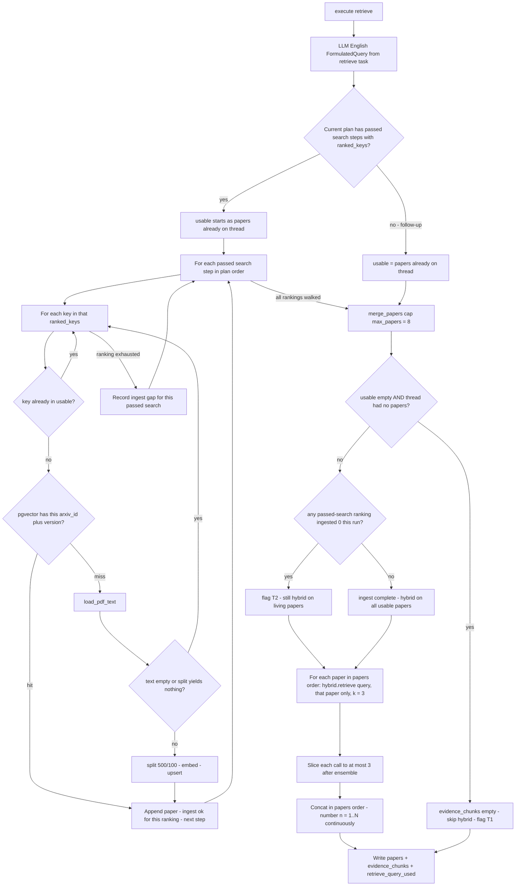
```mermaid
flowchart TB
  R[execute retrieve] --> Q[LLM English FormulatedQuery from retrieve task]
  Q --> CUR{Current plan has passed search steps with ranked_keys?}
  CUR -->|no - follow-up| BASE[usable = papers already on thread]
  CUR -->|yes| WALK[usable starts as papers already on thread]
  WALK --> STEP[For each passed search step in plan order]
  STEP --> KEY[For each key in that ranked_keys]
  KEY --> SKIP{key already in usable?}
  SKIP -->|yes| KEY
  SKIP -->|no| CACHE{pgvector has this arxiv_id plus version?}
  CACHE -->|hit| ADD[Append paper - ingest ok for this ranking - next step]
  CACHE -->|miss| PDF[load_pdf_text]
  PDF --> EMPTY{text empty or split yields nothing?}
  EMPTY -->|yes| KEY
  EMPTY -->|no| UPSERT[split 500/100 - embed - upsert]
  UPSERT --> ADD
  ADD --> STEP
  KEY -->|ranking exhausted| GAP[Record ingest gap for this passed search]
  GAP --> STEP
  STEP -->|all rankings walked| MERGE["merge_papers cap max_papers = 8"]
  BASE --> MERGE
  MERGE --> T1{usable empty AND thread had no papers?}
  T1 -->|yes| SKIPH[evidence_chunks empty - skip hybrid - flag T1]
  T1 -->|no| T2{any passed-search ranking ingested 0 this run?}
  T2 -->|yes| HY[flag T2 - still hybrid on living papers]
  T2 -->|no| HY2[ingest complete - hybrid on all usable papers]
  HY --> PER
  HY2 --> PER[For each paper in papers order: hybrid.retrieve query, that paper only, k = 3]
  PER --> SLICE[Slice each call to at most 3 after ensemble]
  SLICE --> CAT[Concat in papers order - number n = 1..N continuously]
  CAT --> OUT[Write papers + evidence_chunks + retrieve_query_used]
  SKIPH --> OUT
```

Edges inside the walk:

- Champion PDF empty → try 2nd, 3rd, … of **that** artifact list (eval already U1-stripped).
- Collision at retrieve: skip keys already in `usable` (U1 only reserved the **head** at eval; fallback overlap is resolved here).
- Tiny PDF: take however many chunks exist (may be &lt; 3).
- Cache hit: no second PDF download.

---

## 7. Retrieve evaluate — T1 / T2a / T3 / R2

Deterministic T1/T2 **do not wait** for the mini-judge. Semantic judge runs when ingest is complete (T3 path) after chunks exist and are from admitted keys.

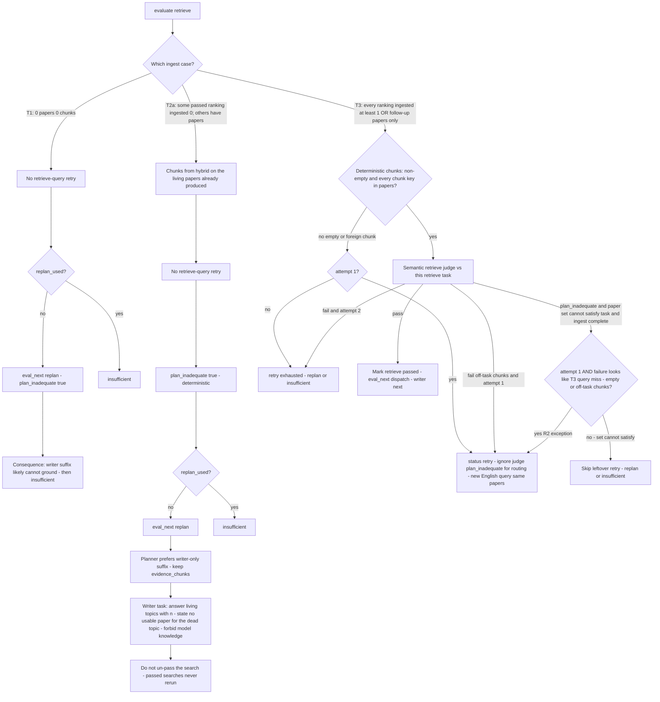
```mermaid
flowchart TB
  EV[evaluate retrieve] --> DET{Which ingest case?}

  DET -->|T1: 0 papers 0 chunks| T1N[No retrieve-query retry]
  T1N --> T1R{replan_used?}
  T1R -->|no| T1P[eval_next replan - plan_inadequate true]
  T1R -->|yes| T1I[insufficient]
  T1P --> NOTE1[Consequence: writer suffix likely cannot ground - then insufficient]

  DET -->|T2a: some passed ranking ingested 0; others have papers| T2H[Chunks from hybrid on the living papers already produced]
  T2H --> T2N[No retrieve-query retry]
  T2N --> T2D[plan_inadequate true - deterministic]
  T2D --> T2R{replan_used?}
  T2R -->|no| T2P[eval_next replan]
  T2R -->|yes| T2I[insufficient]
  T2P --> T2S[Planner prefers writer-only suffix - keep evidence_chunks]
  T2S --> T2W[Writer task: answer living topics with n - state no usable paper for the dead topic - forbid model knowledge]
  T2W --> T2X[Do not un-pass the search - passed searches never rerun]

  DET -->|T3: every ranking ingested at least 1 OR follow-up papers only| SEM{Deterministic chunks: non-empty and every chunk key in papers?}
  SEM -->|no empty or foreign chunk| T3A{attempt 1?}
  T3A -->|yes| T3R[status retry - ignore judge plan_inadequate for routing - new English query same papers]
  T3A -->|no| T3F[retry exhausted - replan or insufficient]
  SEM -->|yes| JUDGE[Semantic retrieve judge vs this retrieve task]
  JUDGE -->|pass| OK[Mark retrieve passed - eval_next dispatch - writer next]
  JUDGE -->|fail off-task chunks and attempt 1| T3R
  JUDGE -->|fail and attempt 2| T3F
  JUDGE -->|plan_inadequate and paper set cannot satisfy task and ingest complete| SKIP{attempt 1 AND failure looks like T3 query miss - empty or off-task chunks?}
  SKIP -->|yes R2 exception| T3R
  SKIP -->|no - set cannot satisfy| NR[Skip leftover retry - replan or insufficient]
```

R2 in one line: **do not** copy search-Q2 onto every retrieve fail. T1/T2a and “this paper set cannot do the task” skip retry. T3 first fail (query miss with a complete ingest) **always** retries once, even if the judge set `plan_inadequate`.

---

## 8. Writer execute + evaluate

Grounding (ORCH-03) plus the hole rule: **model weights are not a source**. Retry = rewrite on the **same** `evidence_chunks`. Replan from writer is rare (question/task stale); usually remaining was already replanned before writer.

A sentence like “no usable arXiv paper/PDF was found for DoRA in this run” is **not** a technical claim and does **not** need `[n]`. Any definition, mechanism, or comparison **of** DoRA is a technical claim: it needs chunks from a DoRA paper. If those chunks do not exist, that prose fails eval (retry: drop the invented DoRA, keep LoRA/QLoRA cited).

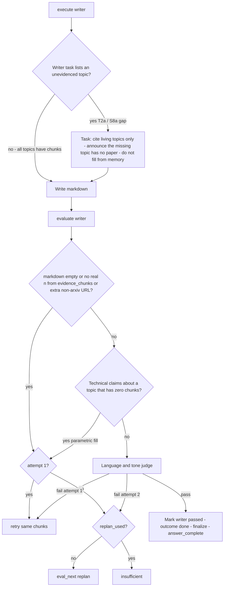
```mermaid
flowchart TB
  W[execute writer] --> TASK{Writer task lists an unevidenced topic?}
  TASK -->|yes T2a / S8a gap| RULE[Task: cite living topics only - announce the missing topic has no paper - do not fill from memory]
  TASK -->|no - all topics have chunks| DRAFT
  RULE --> DRAFT[Write markdown]
  DRAFT --> WE[evaluate writer]
  WE --> D1{markdown empty or no real n from evidence_chunks or extra non-arxiv URL?}
  D1 -->|yes| WR{attempt 1?}
  WR -->|yes| WRET[retry same chunks]
  WR -->|no| WRP{replan_used?}
  WRP -->|no| WREPLAN[eval_next replan]
  WRP -->|yes| WINS[insufficient]
  D1 -->|no| HOLE{Technical claims about a topic that has zero chunks?}
  HOLE -->|yes parametric fill| WR
  HOLE -->|no| WJ[Language and tone judge]
  WJ -->|pass| DONE[Mark writer passed - outcome done - finalize - answer_complete]
  WJ -->|fail attempt 1| WRET
  WJ -->|fail attempt 2| WRP
```

---

## 9. Replan node — shared rules (search or retrieve or writer trigger)

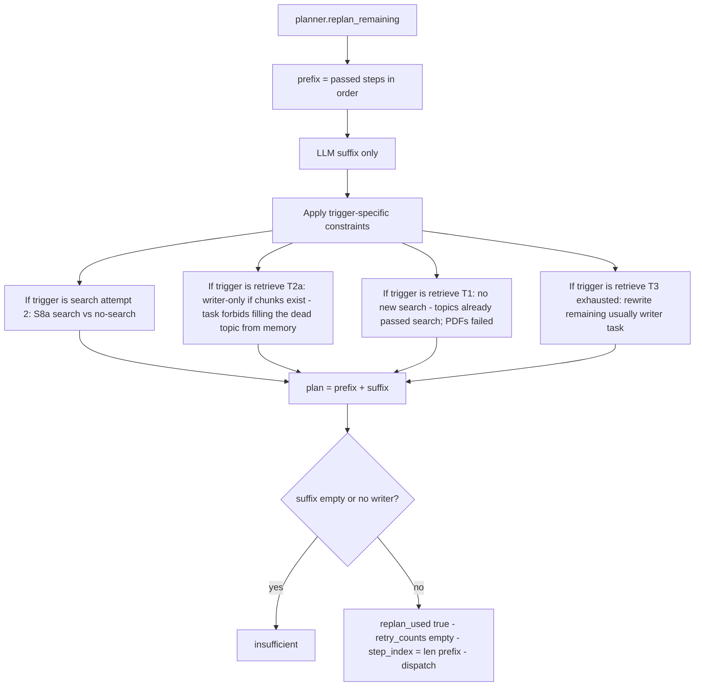
```mermaid
flowchart TB
  P[planner.replan_remaining] --> PRE[prefix = passed steps in order]
  PRE --> SFX[LLM suffix only]
  SFX --> RULES[Apply trigger-specific constraints]
  RULES --> S8a[If trigger is search attempt 2: S8a search vs no-search]
  RULES --> T2[If trigger is retrieve T2a: writer-only if chunks exist - task forbids filling the dead topic from memory]
  RULES --> T1b[If trigger is retrieve T1: no new search - topics already passed search; PDFs failed]
  RULES --> T3b[If trigger is retrieve T3 exhausted: rewrite remaining usually writer task]
  S8a --> PACK[plan = prefix + suffix]
  T2 --> PACK
  T1b --> PACK
  T3b --> PACK
  PACK --> Z{suffix empty or no writer?}
  Z -->|yes| INS[insufficient]
  Z -->|no| GO[replan_used true - retry_counts empty - step_index = len prefix - dispatch]
```

New search after S8a `plan_inadequate=false`: uniqueness at **eval** still uses champions already on **passed** artifacts (papers may still be empty until retrieve).

---

## 10. Caps and abort (overlay on every hop)

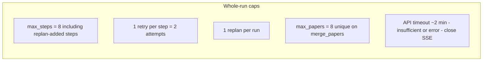
```mermaid
flowchart LR
  subgraph caps [Whole-run caps]
    MS[max_steps = 8 including replan-added steps]
    MR[1 retry per step = 2 attempts]
    MP[1 replan per run]
    M8[max_papers = 8 unique on merge_papers]
    TO[API timeout ~2 min - insufficient or error - close SSE]
  end
```

If `max_papers` is already 8 on the thread, a newly ingested champion may be **trimmed** by FIFO merge (pre-existing reducer). Retrieve still must not use a single global `LIMIT k` on the union of chunks.

---

## 11. End-to-end traces

### 11a. Happy path — compare LoRA / QLoRA / DoRA

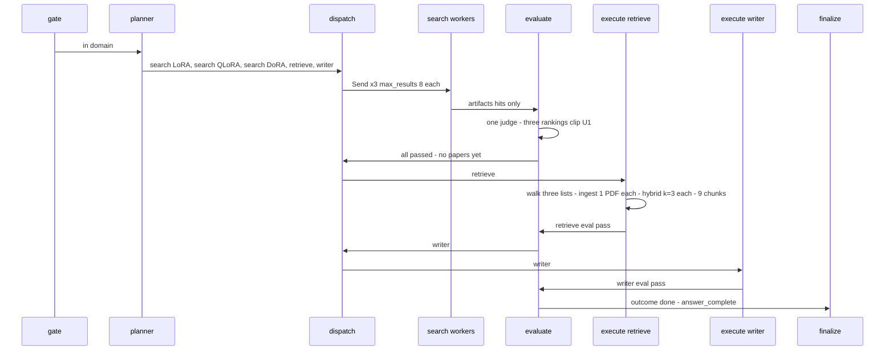
```mermaid
sequenceDiagram
  participant G as gate
  participant P as planner
  participant D as dispatch
  participant S as search workers
  participant E as evaluate
  participant X as execute retrieve
  participant W as execute writer
  participant F as finalize

  G->>P: in domain
  P->>D: search LoRA, search QLoRA, search DoRA, retrieve, writer
  D->>S: Send x3 max_results 8 each
  S->>E: artifacts hits only
  E->>E: one judge - three rankings clip U1
  E->>D: all passed - no papers yet
  D->>X: retrieve
  X->>X: walk three lists - ingest 1 PDF each - hybrid k=3 each - 9 chunks
  X->>E: retrieve eval pass
  E->>D: writer
  D->>W: writer
  W->>E: writer eval pass
  E->>F: outcome done - answer_complete
```

### 11b. Search miss — attempt 1 retry, attempt 2 S8a gap

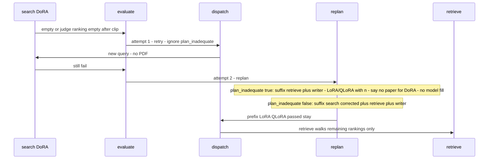
```mermaid
sequenceDiagram
  participant S as search DoRA
  participant E as evaluate
  participant D as dispatch
  participant R as replan
  participant X as retrieve

  S->>E: empty or judge ranking empty after clip
  E->>D: attempt 1 - retry - ignore plan_inadequate
  D->>S: new query - no PDF
  S->>E: still fail
  E->>R: attempt 2 - replan
  Note over R: plan_inadequate true: suffix retrieve plus writer - LoRA/QLoRA with n - say no paper for DoRA - no model fill
  Note over R: plan_inadequate false: suffix search corrected plus retrieve plus writer
  R->>D: prefix LoRA QLoRA passed stay
  D->>X: retrieve walks remaining rankings only
```

### 11c. Same paper would win two topics (U1 + retrieve skip)

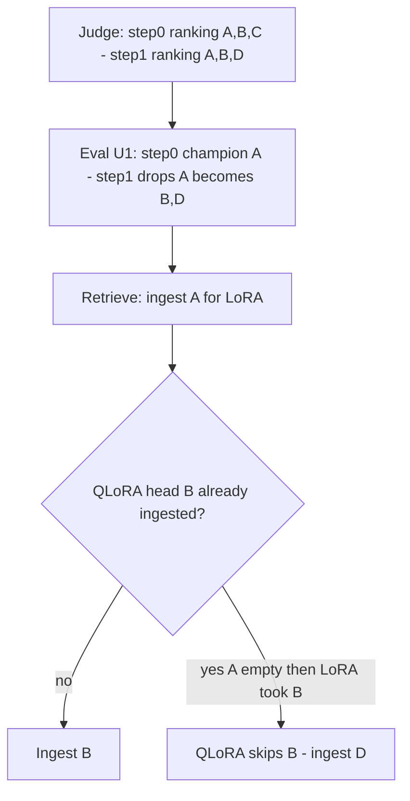
```mermaid
flowchart TB
  J[Judge: step0 ranking A,B,C - step1 ranking A,B,D] --> U[Eval U1: step0 champion A - step1 drops A becomes B,D]
  U --> RET[Retrieve: ingest A for LoRA]
  RET --> COLL{QLoRA head B already ingested?}
  COLL -->|no| BOK[Ingest B]
  COLL -->|yes A empty then LoRA took B| SKIP[QLoRA skips B - ingest D]
```

If after U1 a step’s ranking is empty → that **search** fails (retry/replan), even if the judge had passed.

### 11d. Champion PDF empty — walk fallback (D2)

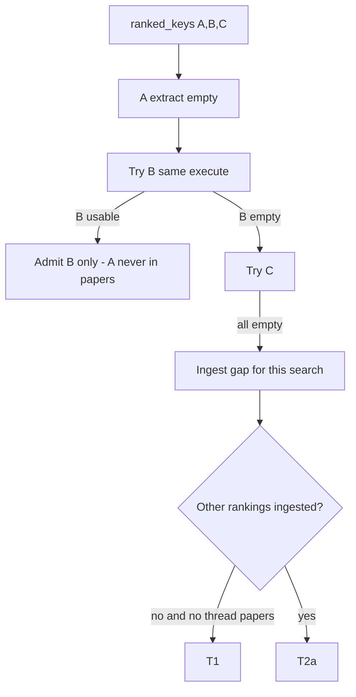
```mermaid
flowchart TB
  L[ranked_keys A,B,C] --> PDF[A extract empty]
  PDF --> B[Try B same execute]
  B -->|B usable| ADM[Admit B only - A never in papers]
  B -->|B empty| C[Try C]
  C -->|all empty| GAP[Ingest gap for this search]
  GAP --> T{Other rankings ingested?}
  T -->|no and no thread papers| T1[T1]
  T -->|yes| T2[T2a]
```

### 11e. T2a — DoRA PDF dead, LoRA and QLoRA live

The student still gets an answer: LoRA vs QLoRA from chunks `[n]`. DoRA is **only** reported as not found (no usable paper/PDF in this run). The Writer MUST NOT use pretraining knowledge to “complete” DoRA.

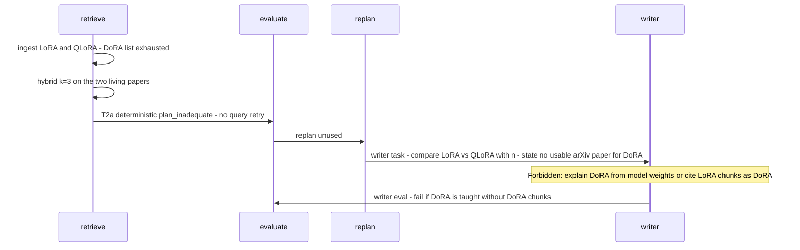
```mermaid
sequenceDiagram
  participant X as retrieve
  participant E as evaluate
  participant R as replan
  participant W as writer

  X->>X: ingest LoRA and QLoRA - DoRA list exhausted
  X->>X: hybrid k=3 on the two living papers
  X->>E: T2a deterministic plan_inadequate - no query retry
  E->>R: replan unused
  R->>W: writer task - compare LoRA vs QLoRA with n - state no usable arXiv paper for DoRA
  Note over W: Forbidden: explain DoRA from model weights or cite LoRA chunks as DoRA
  W->>E: writer eval - fail if DoRA is taught without DoRA chunks
```

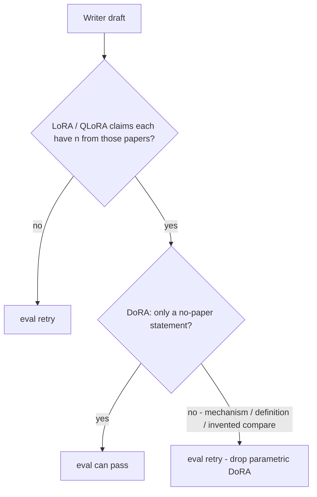
```mermaid
flowchart TB
  ANS[Writer draft] --> A{LoRA / QLoRA claims each have n from those papers?}
  A -->|no| FAIL[eval retry]
  A -->|yes| B{DoRA: only a no-paper statement?}
  B -->|yes| PASS[eval can pass]
  B -->|no - mechanism / definition / invented compare| FAIL2[eval retry - drop parametric DoRA]
```

### 11f. T3 — ingest OK, hybrid off-task

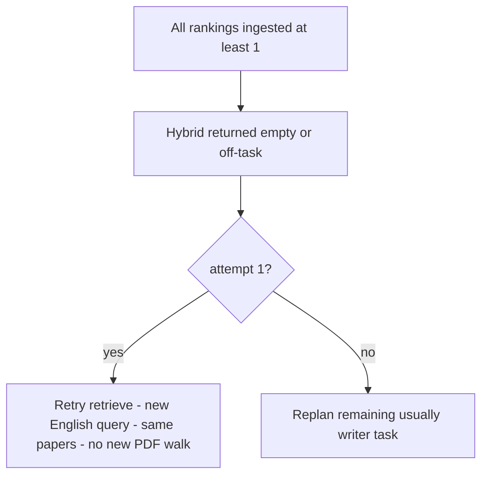
```mermaid
flowchart TB
  A[All rankings ingested at least 1] --> H[Hybrid returned empty or off-task]
  H --> R1{attempt 1?}
  R1 -->|yes| RQ[Retry retrieve - new English query - same papers - no new PDF walk]
  R1 -->|no| RP[Replan remaining usually writer task]
```

### 11g. T1 — every ranking ingest-failed, empty thread

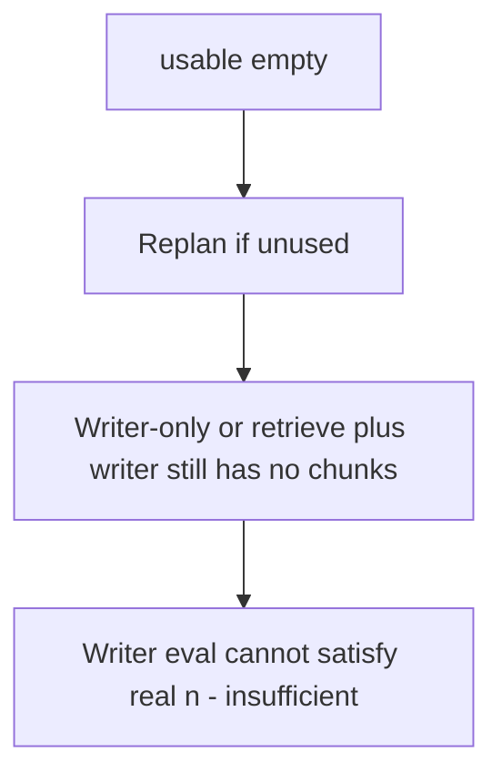
```mermaid
flowchart TB
  Z[usable empty] --> RP[Replan if unused]
  RP --> W[Writer-only or retrieve plus writer still has no chunks]
  W --> INS[Writer eval cannot satisfy real n - insufficient]
```

No new arXiv search: searches already passed; the failure is PDF extract.

---

## 12. What never happens on this graph

- `SearchRunner` picking 1 of 8 (judge + clip + U1 only).
- `papers` filled at search eval pass.
- `hybrid.retrieve(query, all_papers, k)` as a single union limit.
- MMR / score threshold (no score on `EvidenceChunk`).
- Third agent / extra picker LLM.
- Rewriting passed steps.
- New SSE event **names**.
- `top_k=1` on the arXiv API.
- First search miss burning `max_replans` (attempt 1 always retries the same search).
- Retrieve query retry as a substitute for an empty PDF (T1/T2a).
- Un-passing a search because its PDF later died (T2a: writer announces no paper, answers the living topics).
- Filling a missing topic from the Writer LLM’s own knowledge (parametric memory is not evidence).
