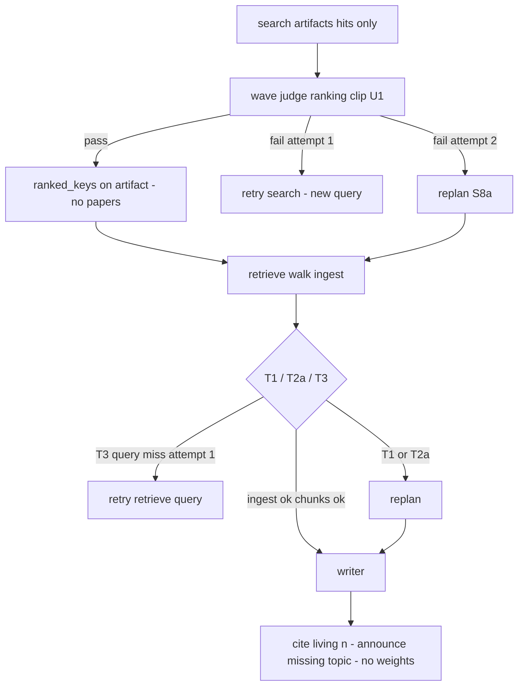

# Admission 1/topic and Per-Paper Retrieve Specification

**Feature:** `admission-retrieve-per-topic`  
**Spec status:** Approved (2026-08-29)  
**Date:** 2026-08-29  
**Design:** `.specs/features/admission-retrieve-per-topic/design.md` (approved 2026-08-29)  
**Parent loop:** `.specs/features/orchestrator-eval-replan/spec.md` (approved)  
**Parent product:** `.specs/features/arxiv-grounded-research/spec.md` (approved v1)  
**Architecture constraints:** `.specs/features/arxiv-grounded-research/context.md` (PAT-01–PAT-12 still apply)  
**Routing atlas (grilled):** `.specs/features/admission-retrieve-per-topic/graph-flow.md`

This spec defines **only** how papers are chosen, admitted, retrieved, and how search/retrieve misses retry or replan — plus the Writer hole rule (no parametric fill). Gate, allowlist, recency, splitter 500/100, hybrid **weights** 0.7/0.3, SSE event **names**, Chainlit, checkpointer, models, `max_steps=8`, `max_papers=8`, `max_retries_per_step=1`, `max_replans=1`, and timeout stay as in the parent specs unless an ID below explicitly supersedes them.

## Problem Statement

A compare plan (`search LoRA`, `search QLoRA`, `search DoRA`, `retrieve`, `writer`) can still starve later topics: each search fetches up to 8 hits, eval pass admits the **whole** lot, and `merge_papers` FIFO-trims to 8, so the first search can fill the cap. Retrieve then runs one hybrid over the union with a single `k`, so one PDF can take almost all chunks. Students get a “comparison” evidenced by one method, or a Writer that fills missing methods from model weights. This product’s contract is **one named topic per search step, one usable PDF per topic, a chunk floor per paper, and grounded prose only** — not academic IR recall.

## Goals

- [ ] A compare of N named methods admits **at most one paper per passed search**, so later topics are not dropped by FIFO `max_papers`.
- [ ] Retrieve returns **up to 3 chunks per admitted paper** (concatenated, continuous `[n]`), never a single union `LIMIT k`.
- [ ] First cheap search miss retries the same step (new arXiv query, no PDF) and does **not** spend the one replan; a missing topic is **announced**, never taught from parametric memory.

## Out of Scope

Explicitly excluded. Documented to prevent scope creep.

| Feature | Reason |
| ------- | ------ |
| Admitting 2–3 papers per search | Product lock: 1/topic; PDF is expensive |
| `top_k=1` / `max_results=1` on the arXiv API | Pool for the judge; cut at eval |
| Extra picker LLM or picker inside `SearchRunner` | Same wave judge; no third agent |
| MMR, score threshold, global rerank | `EvidenceChunk` has no score |
| Full-PDF rerank | Cost; not this product |
| New SSE event names | Parent SSE-01 vocabulary |
| Changing Gate, splitter sizes, hybrid **weights**, Writer `[n]` **format**, `answer_complete` payload | Parent |
| Un-passing a search because its PDF later failed | Passed steps never rerun; Writer announces the hole |
| Filling a missing topic from Writer model weights | Grounded generation |

### Supersedes (loop spec)

Upon approval, these loop IDs are **replaced** by this feature (do not implement both). Unnamed loop IDs stay in force.

| Parent ID | What no longer holds |
| --------- | -------------------- |
| SEARCH-01 (admission) | A passing search admits **all** filtered artifact hits into `papers`. **Unchanged:** no PDF in search; formulate arXiv query from `task`; retry = new query; consecutive searches may `Send`; only **passing** searches contribute a ranking. |
| SEARCH-02 (verdict shape) | Wave verdict is only `passed` / `plan_inadequate` / `feedback`. **Unchanged:** one LLM call per wave, N independent verdicts, retry wave = still-unpassed subset. |
| RETR-01 (retrieve `k`) | One `hybrid.retrieve(query, all_admitted_keys, k=Policy.retrieve_k)` with `retrieve_k=8`. **Unchanged:** miss → PDF → split 500/100 → embed; EnsembleRetriever 0.7/0.3; English formulated query; retry query uses the **same** admitted set when ingest was complete. |
| LOOP-03 (search, attempt 1) | `plan_inadequate` skips leftover retry **on the first search attempt**. **Unchanged:** after search retry is used, fail or `plan_inadequate` → replan remaining if unused, else `insufficient`; passed steps never redone. |

**Amended (not replaced):** REPLAN-02 still forbids a Writer tasked as if a failed topic were evidenced; this spec adds S8a (corrected search vs gap) and T2a (writer-only suffix when chunks already exist). ORCH-03 / GROUND-01–03 stay; WRITE-02 **extends** them with the hole rule.

---

## User Stories

### P1: One paper per named search topic ⭐ MVP

**User Story**: As a student comparing named methods, I want each search step to contribute at most one arXiv paper so that LoRA cannot occupy all eight slots and QLoRA/DoRA still have a chance.

**Why P1**: FIFO admission of whole lots is why compare plans lie today. 1/topic is this product’s cost contract (PDF expensive, `max_papers=8`), not an IR lab contract.

**Acceptance Criteria**:

1. WHEN the Planner emits a plan THEN it SHALL treat each `search` step as **one named topic** (distinct `task` texts for a compare). The Orchestrator SHALL NOT admit more than one usable `(arxiv_id, version)` per **passed** search ranking.
2. WHEN a `search` step runs THEN it SHALL formulate the arXiv `search_query` as today (SEARCH-01 formulate) and SHALL call the API with `max_results=8` (never 1). It SHALL apply the same deterministic allowlist + recency (or `historical`) filter, dedupe `(arxiv_id, version)`, and SHALL write **only** `search_artifacts` (`query_used` + filtered `hits`). It SHALL NOT write `papers` and SHALL NOT download PDFs.
3. WHEN a search wave has returned THEN semantic eval SHALL remain **one** structured LLM call over that wave (SEARCH-02). Each step’s verdict SHALL include an **ordered list of acceptable paper keys** `(arxiv_id, version)` for that step’s task (titles + abstracts only). The runtime SHALL clip that list to keys present in **that** artifact’s hits (drop hallucinations). Deterministic empty / none-allowlisted / none-in-recency SHALL force an empty ranking (`passed` cannot be true) but SHALL still be included in the one LLM call so the judge can set `plan_inadequate`.
4. WHEN the clipped ranking is processed in **plan order** THEN uniqueness SHALL be **U1**: drop keys that are already the **champion** (ranking head after previous strips) of an earlier passed search in this wave **or** of a passed search artifact already on the plan (prefix / prior wave). Papers MAY still be empty. The runtime SHALL persist the clipped, U1-stripped list as `ranked_keys` on the **full** artifact (must keep `hits` and `query_used`). `passed` SHALL be true iff that list is non-empty. The assigned set SHALL gain **only this ranking’s head**, not the whole fallback list.
5. WHEN a search step passes THEN evaluate SHALL add its index to `passed_steps` and SHALL **not** write `papers`. Search `step_end.paper_ids` SHALL remain the **filtered hits** (ranking does not exist until evaluate).
6. WHEN U1 leaves a step’s ranking empty THEN that search SHALL fail even if the judge had passed, and SHALL follow search retry/replan rules (LOOP-04 / REPLAN-03) — not silently share another topic’s paper.

**Independent Test**: Compare query with three distinct search tasks. After a passing wave, `papers` is still empty (or unchanged from the thread). Each passed artifact has `ranked_keys` length ≥ 1 and distinct champions across steps. First search’s eight filtered hits are **not** all in `papers`.

---

### P1: Per-paper retrieve floor ⭐ MVP

**User Story**: As a student, I want evidence chunks from every paper that actually ingested so that a single PDF cannot monopolize the Writer’s `[n]` list.

**Why P1**: 1/topic admission is useless if retrieve still returns 7 chunks from one paper and 0 from another.

**Acceptance Criteria**:

1. WHEN the current plan has passed search steps with `ranked_keys` THEN retrieve SHALL, in plan order, walk each list: skip keys already in the usable set (thread `papers` plus papers admitted earlier in this execute); on cache miss load PDF, split 500/100, embed, upsert; on empty extract or empty split try the **next** key on **that** list in the **same** execute (no extra LLM, no new arXiv search). It SHALL admit **at most one usable PDF per ranking**. `merge_papers` / `max_papers=8` still trim the thread set.
2. WHEN a follow-up plan has **no** passed search steps on the **current** plan THEN retrieve SHALL skip the ranking walk and SHALL hybrid over `papers` already on the thread.
3. WHEN hybrid runs THEN for **each** usable paper, in admission order, the system SHALL call `hybrid.retrieve(query, [that_paper], k=3)` and SHALL slice each call to **at most 3** chunks after the ensemble. It SHALL concatenate those lists and number `[n]` continuously from 1. It SHALL NOT run one hybrid over the union with a single `LIMIT k`. A tiny PDF MAY contribute fewer than 3 chunks. A paper with zero chunks SHALL not appear in the concat (it was not usable).
4. WHEN retrieve retries after a **T3** miss (ingest complete) THEN it SHALL formulate a **new** English query from the retrieve `task` plus that step’s feedback and SHALL use the **same** admitted papers. It SHALL NOT re-walk fallback lists for PDFs already found empty in this run.
5. WHEN `Policy` is read THEN `retrieve_k_per_paper` SHALL be 3. The old global `retrieve_k=8` SHALL NOT be the retrieve contract.

**Independent Test**: Three topics ingest successfully → 9 chunks (or fewer if a PDF is tiny), **≥1 chunk per ingested `arxiv_id`** when that PDF produced any text. Force one PDF extract empty with a non-empty fallback on the same ranking → only the fallback is in `papers`; champion never admitted.

---

### P1: Retry, remaining replan, and no parametric fill ⭐ MVP

**User Story**: As a student, I want a bad first search query retried cheaply, a missing method named as missing, and every technical claim tied to a chunk — not a lecture from the model when DoRA has no paper.

**Why P1**: Burning `max_replans=1` on the first empty search, or teaching DoRA from weights, is how the product stops being grounded.

**Acceptance Criteria**:

1. WHEN a search attempt **1** fails (empty filter, judge refuses the lot, ranking empty after clip/U1) THEN the system SHALL retry **that** search (new query, no PDF) and SHALL **ignore** `plan_inadequate` for routing. The flag MAY appear on the `eval` SSE frame.
2. WHEN a search attempt **2** fails THEN the system SHALL replan the remaining suffix if `replan_used` is false, else `insufficient`. Both S8a branches are `eval_next=replan` (the boolean does not pick a graph edge). **S8a:** `plan_inadequate=true` → the Planner MUST NOT emit a new `search` for this topic (topic unrealizable **or** task was fine and two queries failed); typical suffix `retrieve` + `writer` that compares **evidenced** topics and states the hole. `plan_inadequate=false` → the **task** was wrong (angle, alias, `historical`); the Planner MUST emit a **corrected** `search` then retrieve + writer. Passed searches and their `ranked_keys` stay. New-search uniqueness at eval still uses champions already on passed artifacts (papers may still be empty).
3. WHEN retrieve ingest is **T1** (every ranking failed ingest **and** the thread had no papers) THEN the system SHALL NOT retry the retrieve query. It SHALL replan if unused (no new search: searches already passed; failure is PDF), else `insufficient`. Writer on empty chunks SHALL NOT pass ORCH-03 (consequence: the run may spend the replan and then `insufficient`).
4. WHEN retrieve ingest is **T2a** (at least one **passed** search ranking ingested 0; at least one other paper usable) THEN retrieve SHALL still hybrid on the living papers, SHALL NOT retry the retrieve query, and SHALL fail with **deterministic** `plan_inadequate` (do not wait for the mini-judge). Replan if unused: prefer **writer-only** suffix so existing `evidence_chunks` remain; Writer task SHALL answer living topics with `[n]` and state that **no usable arXiv paper/PDF was found** for the dead topic. The dead search SHALL stay in `passed_steps`.
5. WHEN retrieve ingest is **T3** (every walked ranking ingested ≥1, or follow-up papers only) THEN empty / off-task chunks on attempt 1 SHALL retry the retrieve query even if the judge set `plan_inadequate` (**R2** exception). T1, T2a, and “this paper set cannot satisfy the task” (ingest complete, not a query miss) SHALL skip leftover retrieve retry. Attempt 2 exhausted → replan remaining (usually Writer `task`) or `insufficient`.
6. WHEN the Writer drafts THEN model weights SHALL NOT be a source. A sentence that no usable paper was found for a named topic is **not** a technical claim and SHALL NOT require `[n]`. Any definition, mechanism, or comparison **of** that topic IS a technical claim and SHALL require chunks from **that** topic’s paper. Citing LoRA/QLoRA chunks as if they were DoRA SHALL fail Writer eval (retry: drop invented DoRA, keep living topics cited). ORCH-03 deterministic `[n]` + no extra URLs stay. Retry uses the **same** `evidence_chunks`.

**Independent Test**: (a) First search empty → second search execute, no `plan` SSE yet. (b) Second search fail + `plan_inadequate=true` → `plan` suffix without a new search; Writer does not explain the missing method from memory. (c) T2a: two PDFs live, one ranking exhausted → hybrid on two; `eval` retrieve `plan_inadequate`; writer-only replan; answer cites LoRA/QLoRA `[n]` and states DoRA not found. (d) T3 first hybrid miss → second retrieve execute, same `papers`, new query.

---

## Edge Cases

- WHEN after filter a search artifact has zero hits THEN that attempt SHALL fail deterministically; attempt 1 retries; it SHALL NOT be treated as “topic cannot exist” for routing until attempt 2 + S8a.
- WHEN the judge returns `passed=true` but clip/U1 yields an empty list THEN the step SHALL fail (not pass).
- WHEN two rankings share fallback keys THEN eval U1 SHALL reserve only heads; retrieve SHALL skip keys already in `usable` (fallback collision resolved at ingest).
- WHEN champion PDF text is empty THEN retrieve SHALL try the next `ranked_keys` entry in the same execute. That is **not** an arXiv miss and SHALL NOT retry search.
- WHEN every fallback PDF for a ranking is empty and other rankings ingested THEN T2a SHALL apply (do not un-pass the search).
- WHEN `max_papers=8` is already full on the thread THEN a newly ingested paper MAY be trimmed by existing FIFO `merge_papers` (pre-existing reducer). Retrieve SHALL still not use a union `LIMIT k`.
- WHEN a new search is added by S8a (`plan_inadequate=false`) THEN eval uniqueness SHALL skip champions already stored on passed artifacts.
- WHEN retrieve T2a replans but `replan_used` is already true THEN the run SHALL `insufficient` (living chunks are not a student-visible answer without Writer pass).
- WHEN Writer eval fails the hole rule on attempt 1 THEN retry SHALL rewrite on the same chunks (drop parametric fill).
- WHEN timeout or `max_steps` hits THEN parent CAP-02 / timeout rules apply, including steps added by replan.
- WHEN the student query is not English THEN search/retrieve queries stay English; Writer hole language SHALL match the student query; titles/excerpts stay as sourced.
- WHEN N parallel searches complete THEN the system SHALL NOT issue N ranking LLM calls (still one wave call).

---

## Constraints (locked for this feature)

| Area | Decision |
| ---- | -------- |
| Cardinality | 1 usable paper per passed search ranking; all plan shapes (explain / compare / follow-up) |
| API pool | `max_results=8`; never 1 |
| Picker | Wave judge ranking + deterministic clip + U1; no `SearchRunner` picker |
| Admission time | Ranking at search eval pass; `papers` only after successful ingest |
| Uniqueness | U1 champion-only at eval; skip `usable` keys at retrieve |
| Retrieve `k` | `retrieve_k_per_paper=3`; per-paper hybrid; slice after ensemble; concat; continuous `[n]` |
| Search attempt 1 | Always retry on fail; ignore `plan_inadequate` for routing |
| Search attempt 2 | Always replan if unused; S8a reuses `plan_inadequate` (no new enum) |
| Retrieve T1 / T2a | No query retry; T2a deterministic `plan_inadequate`; prefer writer-only if chunks exist |
| Retrieve T3 attempt 1 | Always query retry (R2); ignore judge `plan_inadequate` for routing |
| Hole | No parametric fill; absence sentence without `[n]`; living topics grounded |
| Caps | Parent caps unchanged; PDF empty does not add a search on T1/T2a |
| SSE | Same event names; additive `eval` fields already allowed (`step_index`, `plan_inadequate`) |

```text
search wave
  → filter 8 hits into search_artifacts (no papers)
  → one judge: ranked_keys per step, clip, U1
  → attempt 1 fail → retry same search
  → attempt 2 fail → replan (S8a: gap vs corrected search)
retrieve
  → walk each passed ranking; one usable PDF each; fallback in-execute
  → T1 / T2a / T3 routing as above
  → hybrid per paper k=3 → continuous [n]
writer
  → living topics with [n]; missing topic = no paper found; no model fill
```



**Eval checklists (normative additions):**

- **search** — titles + abstracts match **this** task; allowlist + recency (or historical); output a ranking of acceptable keys; runtime clip + U1. No PDF. Attempt 1 fail → retry query. Attempt 2 → S8a via `plan_inadequate`.
- **retrieve** — `[n]` only from admitted keys; per-paper k=3. T1/T2a are deterministic. T3 semantic judge vs retrieve `task`. R2 as above.
- **writer** — ORCH-03 plus WRITE-02 hole rule.

---

## Requirement Traceability

Each requirement gets a unique ID for tracking across design, tasks, and validation.

| Requirement ID | Story | Phase | Status |
| -------------- | ----- | ----- | ------ |
| ADM-01 | P1: One paper per topic | Execute | ✅ Verified |
| ADM-02 | P1: One paper per topic | Execute | ✅ Verified |
| ADM-03 | P1: One paper per topic | Execute | ✅ Verified |
| ADM-04 | P1: One paper per topic | Execute | ✅ Verified |
| RETR-02 | P1: Per-paper retrieve | Execute | ✅ Verified |
| RETR-03 | P1: Per-paper retrieve | Execute | ✅ Verified |
| RETR-04 | P1: Retry / hole | Execute | ✅ Verified |
| LOOP-04 | P1: Retry / hole | Execute | ✅ Verified |
| LOOP-05 | P1: Retry / hole | Execute | ✅ Verified |
| REPLAN-03 | P1: Retry / hole | Execute | ✅ Verified |
| WRITE-02 | P1: Retry / hole | Execute | ✅ Verified |

**ID map (normative behavior):**

- **ADM-01** — One `search` step = one named topic = at most one usable paper admitted from that ranking. Planner typical shapes unchanged except this cardinality.
- **ADM-02** — Search fetches `max_results=8`, filters as today, writes artifacts only; never API `top_k=1`; never writes `papers`.
- **ADM-03** — One wave LLM call; per-step ordered acceptable keys; clip to artifact hits; `passed` iff list non-empty after clip + U1; persist `ranked_keys` on the full artifact.
- **ADM-04** — U1: uniqueness uses champion heads only at eval; retrieve skips keys already in `usable`. Empty after U1 → that search fails.
- **RETR-02** — `retrieve_k_per_paper=3`; one hybrid call per usable paper; slice after ensemble; concat in admission order; continuous `[n]`. No union `LIMIT k`. Follow-up without current-plan searches: hybrid over thread `papers` only.
- **RETR-03** — Retrieve walks `ranked_keys` and admits the first usable PDF per ranking in the same execute. Empty PDF ≠ arXiv miss. T3 retry does not re-walk exhausted PDFs.
- **RETR-04** — T1 / T2a / T3 as in P1 story 3. T2a: hybrid on living papers; deterministic `plan_inadequate`; do not un-pass search.
- **LOOP-04** — Search attempt 1 never routes on `plan_inadequate`; always retry the same search when the ranking is empty / off-task.
- **LOOP-05** — Retrieve R2: T3 attempt 1 always query-retry (ignore judge `plan_inadequate` for routing). T1, T2a, and paper-set inadequate skip retrieve retry.
- **REPLAN-03** — S8a meaning of `plan_inadequate` on search attempt 2; no new enum; both branches are remaining-only replan. T2a prefers writer-only suffix when chunks exist. T1 forbids a new search.
- **WRITE-02** — No parametric fill. Absence sentence without `[n]`. Technical claims about a topic require chunks from that topic’s paper. Mis-citing another method’s chunks as the missing topic fails Writer eval.

**Coverage:** 11 total, 11 mapped to stories, 0 unmapped. Design approved. Tasks T1–T15 executed 2026-08-30. Feature validation 2026-08-30 found replan index drift and Writer hole lists; both fixed the same day (prefix remaps `search_artifacts` / `eval_by_step`; `hole_tasks` persist S8a and T2a holes). Manual UAT still pending (B-001).

---

## Success Criteria

- [ ] Compare LoRA / QLoRA / DoRA: three passed searches → three distinct champions in `ranked_keys`; after retrieve, at most one paper per ranking; Writer sees chunks from each ingested PDF.
- [ ] First search miss: second search execute, no replan SSE yet.
- [ ] T2a: student-visible answer compares the living methods with real `[n]` and states the missing method has no usable paper; no DoRA lecture from weights.
- [ ] Retrieve never returns a single global top-k over the union when two or more papers are usable.
- [ ] Gate, SSE event names, splitter, and Writer `[n]` **format** unchanged.

---

## Confirm before Execute

Executed 2026-08-30 (`tasks.md` T1–T15). Manual UAT still pending (B-001).
