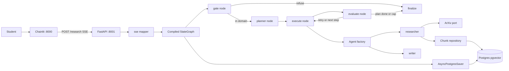
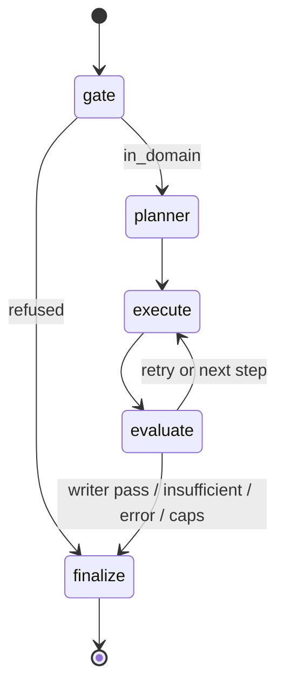

# ArXiv-Grounded Plan-Based Research Design

**Spec**: `.specs/features/arxiv-grounded-research/spec.md`  
**Context**: `.specs/features/arxiv-grounded-research/context.md` (PAT-01–PAT-12 locked)  
**Status**: Approved (2026-08-26)

---

## Architecture Overview

FastAPI is the only HTTP edge. It compiles **one** LangGraph `StateGraph` at process start (lifespan) with `AsyncPostgresSaver` on a **psycopg `AsyncConnectionPool`**. Each `POST /research` validates `{ query, thread_id }`, then `astream`s the graph with `stream_mode=["updates", "custom"]`. A mapper turns custom writer payloads into spec SSE event names. Chainlit is a separate host process that only HTTP-streams that route.

LangGraph **is** the orchestrator (PAT-01). The Planner emits `{ agent, task, reasoning }[]`. An execute node looks up `step.agent` in the agent registry/factory (no `if/elif` on names). Eval strategies return `{ status, feedback }`, not exceptions (PAT-05). ArXiv and pgvector sit behind outbound ports (PAT-08). Chunk identity is `(arxiv_id, version)` in a dedicated repository (PAT-09).





**Research notes (verification chain):**

- Codebase: no application package yet; `pyproject.toml` still lists `langchain-tavily` (remove at implement).
- LangGraph streaming: nodes/tools emit via `get_stream_writer()` or async `writer: StreamWriter`; consume with `astream(..., stream_mode=["updates", "custom"], version="v2")` ([LangGraph streaming](https://docs.langchain.com/oss/python/langgraph/streaming)).
- Checkpointer: `AsyncPostgresSaver(pool)` + `await setup()` on a long-lived `AsyncConnectionPool` (`autocommit=True`, `row_factory=dict_row`). Do **not** pass the `from_conn_string(...)` context manager into `compile` without entering it in lifespan.
- FastAPI SSE: `context.md` PAT-11 locks **`StreamingResponse`** + `event:`/`data:` frames. Installed FastAPI 0.141.x in this repo does **not** expose `fastapi.sse.EventSourceResponse` (verified in `.venv`). Do not add `sse-starlette`.
- Vector store: `langchain-postgres.PGVectorStore` can filter metadata, but **existence** of `(arxiv_id, version)` and RAG **only** over selected papers is simpler with our own `papers` + `chunks` tables and SQL in `repo/chunks.py`.

---

## Code Reuse Analysis

### Existing Components to Leverage

| Component | Location | How to Use |
| --------- | -------- | ---------- |
| FastAPI + uvicorn | `pyproject.toml` `fastapi[standard]` | App, lifespan, `StreamingResponse` |
| LangGraph | `langgraph>=1.2.11` | `StateGraph`, reducers, `astream` |
| LangChain OpenAI | `langchain-openai` | `ChatOpenAI` / `init_chat_model`, `OpenAIEmbeddings` |
| dotenv | `python-dotenv` | Local `.env`; prefer `pydantic-settings` for typed config |

### Integration Points

| System | Integration Method |
| ------ | ------------------ |
| PostgreSQL + pgvector | Docker Compose image `pgvector/pgvector`; one `DATABASE_URL` |
| LangGraph checkpoints | `langgraph-checkpoint-postgres` tables via `AsyncPostgresSaver.setup()` |
| Paper chunks | App-owned tables `papers`, `chunks` (see Data Models); not library-wide k-NN |
| arXiv | `langchain_community` retriever/loader inside `adapters/arxiv.py`, sync I/O in `asyncio.to_thread` |
| Chainlit | Separate `chainlit run`; `httpx` SSE client to FastAPI only |

No `.specs/codebase/CONCERNS.md` (greenfield).

---

## Components

### Settings / policy (PAT-10)

- **Purpose**: Single copy of allowlist, caps, recency, splitter, models, grounding rule.
- **Location**: `src/plan_based_researcher/config.py`, `src/plan_based_researcher/policy.py`
- **Interfaces**:
  - `Settings` — `openai_api_key`, `database_url`, `api_host`, `api_port` (8001), `research_timeout_seconds` (120)
  - `Policy.arxiv_categories: frozenset[str]`
  - `Policy.max_steps`, `max_retries_per_step`, `max_papers`, `recency_years`, `chunk_size`, `chunk_overlap`
  - `Policy.is_allowlisted(categories: list[str]) -> bool`
  - `Policy.within_recency(published, *, historical: bool) -> bool`
- **Dependencies**: `pydantic-settings`
- **Reuses**: Spec constraints table

### Agent registry + factory (PAT-02)

- **Purpose**: One map of agent name → abilities text + model tier + tools + output schema. Planner prompt is generated from this map. Execute node dispatches by name.
- **Location**: `src/plan_based_researcher/agents/registry.py`, `factory.py`
- **Interfaces**:
  - `AgentSpec(name, abilities, model, tools: tuple[str, ...], role: Literal["gate","planner","researcher","writer"])`
  - `REGISTRY: dict[str, AgentSpec]` — v1 keys: `gate`, `planner`, `researcher`, `writer`
  - `planner_prompt_abilities() -> str` — concatenated abilities for PLAN-01
  - `AgentFactory.create(name: str) -> AgentRunner`
  - `AgentRunner.run(state: GraphState) -> dict` — partial state update
- **Dependencies**: Chat models (`gpt-5.1` planner/writer, `gpt-5-mini` others), tool registry for researcher
- **Reuses**: LangChain `with_structured_output` for gate and planner

### Tool registry (PAT-03)

- **Purpose**: Construct arXiv search/load tools once; researcher obtains them by name.
- **Location**: `src/plan_based_researcher/agents/tools.py`
- **Interfaces**:
  - `ToolRegistry.get(name: Literal["arxiv_search","arxiv_load"]) -> BaseTool | PaperPort`
- **Dependencies**: `ports.papers.PaperPort`
- **Reuses**: LangChain `ArxivRetriever` / `ArxivQueryRun`, `ArxivLoader` **only** inside the arXiv adapter

### Paper port + arXiv adapter (PAT-08)

- **Purpose**: Search metadata and load PDF text without leaking LangChain types into graph nodes.
- **Location**: `src/plan_based_researcher/ports/papers.py`, `adapters/arxiv.py`
- **Interfaces**:
  - `PaperHit(arxiv_id, version, title, year, url, categories, published_at, abstract)`
  - `PaperPort.search(query: str, *, max_results: int) -> list[PaperHit]` (async; wrap sync client in `to_thread`)
  - `PaperPort.load_pdf_text(arxiv_id: str, version: str) -> str` (async/`to_thread`)
- **Dependencies**: `langchain_community`, `arxiv`, PDF parser used by `ArxivLoader` (typically PyMuPDF)
- **Reuses**: Official LangChain arXiv integrations only (ARX-01)

### Chunk repository (PAT-09)

- **Purpose**: Persist embeddings; skip PDF on hit; similarity search **filtered** to selected papers.
- **Location**: `src/plan_based_researcher/repo/chunks.py`, `ports/chunks.py`
- **Interfaces**:
  - `get_paper(arxiv_id: str, version: str) -> PaperRecord | None`
  - `upsert_paper_with_chunks(paper, chunks: list[str], embeddings: list[list[float]]) -> None`
  - `similarity_search(query_embedding, paper_keys: list[tuple[str, str]], k: int) -> list[EvidenceChunk]`
- **Dependencies**: psycopg async, `pgvector` type, embedding port
- **Reuses**: Same pool as checkpointer **or** a second pool on the same DSN (prefer **one pool**, two concerns)

### Embedding port

- **Purpose**: `text-embedding-3-small` (1536-d) behind a port so the repo does not import OpenAI.
- **Location**: `src/plan_based_researcher/ports/embeddings.py`, `adapters/openai_embeddings.py`
- **Interfaces**:
  - `embed_documents(texts: list[str]) -> list[list[float]]`
  - `embed_query(text: str) -> list[float]`
- **Dependencies**: `langchain_openai.OpenAIEmbeddings` (async APIs)
- **Reuses**: OpenAI embeddings already in stack

### Eval strategies (PAT-05)

- **Purpose**: Researcher coverage vs Writer grounding as interchangeable strategies; result type only.
- **Location**: `src/plan_based_researcher/eval/types.py`, `strategies.py`
- **Interfaces**:
  - `EvalResult(status: Literal["pass","retry","fail"], feedback: str)`
  - `EvalStrategy.evaluate(state: GraphState) -> EvalResult` (may call `gpt-5-mini` with a **checklist copied from Policy**, not a second prose spec)
  - `ResearchEvalStrategy` — ORCH-02
  - `WriterEvalStrategy` — ORCH-03 (claims ↔ `[n]`, language, student tone, no extra sources)
- **Dependencies**: Agent factory (mini model), `policy.py`
- **Reuses**: Structured output for the judge

### Graph state + build (PAT-01, PAT-04, PAT-06, PAT-07)

- **Purpose**: Typed state, compile once, plan interpreter loop.
- **Location**: `src/plan_based_researcher/graph/state.py`, `build.py`, `nodes/*.py`
- **Interfaces**:
  - `build_graph(deps: GraphDeps) -> CompiledStateGraph`
  - Nodes (all async): `gate`, `planner`, `execute`, `evaluate`, `finalize`
  - `execute`: `spec = REGISTRY[plan[step_index].agent]`; `factory.create(spec.name).run(state)`
  - Conditional edges: see state diagram above
  - Each node that must be visible in the UI calls `writer({ "event": "<spec name>", "data": {...} })`
- **Dependencies**: `GraphDeps` (factory, paper port, chunk repo, embeddings, policy, eval strategies)
- **Reuses**: LangGraph `START`/`END`, `add_messages` for `messages`

### SSE mapper + research route (PAT-11, PAT-12, API-01)

- **Purpose**: HTTP boundary: Pydantic in, SSE out; timeout; no graph types in OpenAPI.
- **Location**: `src/plan_based_researcher/api/schemas.py`, `sse.py`, `routes.py`, `deps.py`, `main.py`
- **Interfaces**:
  - `ResearchRequest(query: str, thread_id: str)` — empty `thread_id` → HTTP 400
  - `iter_sse(graph, request) -> AsyncIterator[bytes]` — `asyncio.wait_for` around the stream (CAP-01); format `event: {name}\ndata: {json}\n\n`
  - `POST /research` → `StreamingResponse(..., media_type="text/event-stream")`
  - `GET /health` — DB ping
- **Dependencies**: compiled graph from lifespan `Depends`
- **Reuses**: FastAPI `StreamingResponse` only

### Chainlit client (UI-01–UI-03)

- **Purpose**: Student chat; does not import `plan_based_researcher.graph`.
- **Location**: `src/plan_based_researcher/ui/app.py` (entry: `chainlit run ...`)
- **Interfaces**:
  - `on_chat_start`: `uuid4()` → `cl.user_session["thread_id"]`
  - `on_message`: `httpx.AsyncClient.stream("POST", RESEARCH_URL, json=...)`
  - Map `step_start`/`step_end` → `cl.Step`; `plan` → step/message; `answer_complete` → markdown + `cl.Text(name="[n]", display="side")`
- **Dependencies**: `httpx`, `RESEARCH_API_URL` (default `http://127.0.0.1:8001/research`)
- **Reuses**: Chainlit session + elements per spec

### Compose / runtime (RUN-01)

- **Purpose**: Postgres only in Docker.
- **Location**: `docker-compose.yml`, `.env.example`
- **Interfaces**: service `postgres` with `pgvector/pgvector` image, port 5432, volume
- **Dependencies**: none on host except Docker
- **Reuses**: n/a

---

## Data Models

### HTTP

```python
class ResearchRequest(BaseModel):
    query: str
    thread_id: str = Field(min_length=1)

class Citation(BaseModel):
    n: int
    arxiv_id: str
    title: str
    year: int
    url: str
    excerpt: str
    chunk_id: str

class AnswerCompleteData(BaseModel):
    markdown: str
    citations: list[Citation]
```

### Planner structured output (PLAN-01)

```python
class PlanStep(BaseModel):
    agent: str  # must be a REGISTRY key (validated after parse)
    task: str
    reasoning: str
    historical: bool = False

class ResearchPlan(BaseModel):
    steps: list[PlanStep]
    reuse_existing_papers: bool = False  # follow-up: skip arXiv search when True
```

### Gate structured output (GATE-01)

```python
class GateDecision(BaseModel):
    in_domain: bool
    language: str  # BCP-47 or ISO-ish tag inferred from query
    reason: str
```

### Graph state (PAT-06)

Overwrite scalars each turn unless noted. `messages` uses `add_messages`. `papers` uses a custom reducer: union by `(arxiv_id, version)`, then trim to `Policy.max_papers`.

```python
class EvidenceChunk(TypedDict):
    chunk_id: str
    n: int  # assigned when formatting for the Writer (GROUND-01)
    arxiv_id: str
    version: str
    title: str
    year: int
    url: str
    excerpt: str

class GraphState(TypedDict):
    query: str
    messages: Annotated[list, add_messages]
    papers: Annotated[list[PaperRef], merge_papers]
    plan: list[PlanStep]
    step_index: int
    retry_count: int
    steps_executed: int
    last_agent: str
    last_eval: dict  # EvalResult-shaped
    evidence_chunks: list[EvidenceChunk]
    writer_markdown: str
    citations: list[dict]
    outcome: Literal["pending", "refused", "done", "insufficient", "error"]
    gate: dict
    error_message: str
```

**Relationships**: `papers` are thread-level (checkpointed). `evidence_chunks` are **this run’s** RAG hits, numbered `[1…]` before Writer. Citations in `answer_complete` subset/map those chunks.

### Postgres (app schema; besides LangGraph checkpoint tables)

```sql
CREATE EXTENSION IF NOT EXISTS vector;

CREATE TABLE papers (
  arxiv_id TEXT NOT NULL,
  version TEXT NOT NULL,
  title TEXT NOT NULL,
  year INT NOT NULL,
  url TEXT NOT NULL,
  categories TEXT[] NOT NULL,
  created_at TIMESTAMPTZ NOT NULL DEFAULT now(),
  PRIMARY KEY (arxiv_id, version)
);

CREATE TABLE chunks (
  chunk_id UUID PRIMARY KEY,
  arxiv_id TEXT NOT NULL,
  version TEXT NOT NULL,
  chunk_index INT NOT NULL,
  content TEXT NOT NULL,
  embedding vector(1536) NOT NULL,
  UNIQUE (arxiv_id, version, chunk_index),
  FOREIGN KEY (arxiv_id, version) REFERENCES papers (arxiv_id, version)
);

CREATE INDEX chunks_papers_idx ON chunks (arxiv_id, version);
-- ANN index created after data exists if needed:
-- CREATE INDEX chunks_embedding_idx ON chunks USING ivfflat (embedding vector_cosine_ops);
```

RAG query: `WHERE (arxiv_id, version) IN (...)` then `ORDER BY embedding <=> $query LIMIT k`. Never search the full table for an answer (ARX-03).

---

## Error Handling Strategy

| Error scenario | Handling | User impact |
| -------------- | -------- | ----------- |
| Missing/blank `thread_id` | HTTP 400, no graph | Chainlit must always send UUID |
| Gate out-of-domain | `outcome=refused`; SSE `gate` then `done`; no arXiv | Refusal text in `gate`/`done` data |
| arXiv search empty / none allowlisted | Research eval `retry` then `fail` → `insufficient` | `insufficient` + what was queried |
| PDF parse empty/garbage | Treat paper as failed load; retry or drop; no empty cites | May `insufficient` if none remain |
| pgvector miss then download fail | Eval retry/fail; SSE `step_end` with error | Trace in UI; no fake answer |
| Writer eval fail, retries left | Feedback into execute; increment `retry_count` | Extra `eval` events; no premature markdown |
| Writer eval fail, retries exhausted | `finalize` → `insufficient` | Partial trace, no uncited essay |
| Caps: steps / papers / 120s `wait_for` | Cancel stream; `insufficient` or `error` | Chainlit shows events received |
| Infrastructure (Postgres down, OpenAI 5xx) | Exception → SSE `error`; do not use eval result type | Error message; health check fails |
| Unknown `thread_id` | Empty checkpoint; treat as new thread | First-turn research |
| Planner `agent` not in registry | Eval/fail that step → `error` or retry with feedback | Should be rare; validate after structured parse |

---

## SSE contract (mapper)

Custom LangGraph payloads: `{ "event": str, "data": object }`. Mapper emits only spec names:

| `event` | When | `data` (minimum) |
| ------- | ---- | ---------------- |
| `gate` | After gate node | `in_domain`, `reason`, `language` |
| `plan` | After planner | `steps[]` (`agent`, `task`, `reasoning`, `historical`) |
| `step_start` | Execute begins | `agent`, `task`, `step_index` |
| `step_end` | Execute finishes | `agent`, `paper_ids`, `pgvector` `hit` \| `miss` |
| `eval` | After evaluate | `status`, `feedback`, `agent` |
| `answer_complete` | Writer eval pass only | `markdown`, `citations[]` |
| `done` | Success or refusal (not a paper answer) | `outcome` |
| `insufficient` | Caps / no evidence | `reason`, trace fields as available |
| `error` | Infrastructure | `message` |

No `answer_delta`. Timeout: if `wait_for` fires, mapper yields `insufficient` or `error` and closes.

---

## Tech Decisions (non-obvious)

| Decision | Choice | Rationale |
| -------- | ------ | --------- |
| Checkpointer lifecycle | `AsyncPostgresSaver(AsyncConnectionPool)` in FastAPI lifespan | `from_conn_string` is a CM; per-request compile is forbidden (PAT-07) |
| Chunk storage | SQL `papers` + `chunks`, not PGVectorStore as source of truth | Exact `(arxiv_id, version)` hit test and IN-filter RAG |
| SSE implementation | Hand-rolled `StreamingResponse` frames | PAT-11; no `fastapi.sse` in current 0.141 install |
| Timeout | `asyncio.wait_for` on `astream` in the API | Graph has no global timer; CAP-01 is a request budget |
| Follow-up skip search | Planner field `reuse_existing_papers` | THR-02; execute/researcher must honor it |
| Node DI | Closures over `GraphDeps` at `build_graph` | Compile once; nodes injectable without rebuilding the graph |
| Writer numbering | Assign `n` in execute **after** retrieve, persist on `evidence_chunks` | GROUND-01; eval can regex `[n]` against that list |
| ANN index | Optional `ivfflat` after volume exists | v1 k is small and filtered; sequential scan on a few papers is enough |

---

## Package layout

```
src/plan_based_researcher/
  main.py
  config.py
  policy.py
  api/{main routes, schemas, sse, deps}
  agents/{registry, factory, tools}
  graph/{state, build, nodes/}
  eval/{types, strategies}
  ports/{papers, chunks, embeddings}
  adapters/{arxiv, openai_embeddings}
  repo/chunks.py
  ui/app.py
docker-compose.yml
```

---

## New / removed dependencies (implement phase)

**Add:** `langgraph-checkpoint-postgres`, `psycopg[binary,pool]`, `pgvector`, `langchain-community`, `arxiv`, `langchain-text-splitters`, `chainlit`, `pydantic-settings`, `httpx` (if not already via FastAPI), PDF extra required by `ArxivLoader`.

**Remove:** `langchain-tavily`.

---

## Requirement mapping (design coverage)

API-01, SSE-01, SSE-02, GATE-01, GATE-02, PLAN-01, ORCH-01–03, ARX-01–04, EMB-01, GROUND-01–03, CAP-01, THR-01–02, UI-01–03, RUN-01 — all have a component and data shape above.

---

## Out of design (still deferred)

Hexagonal HTTP adapters, plugin factories, hover JSX, `answer_delta`, auth, thread TTL, Dockerizing API/UI.
