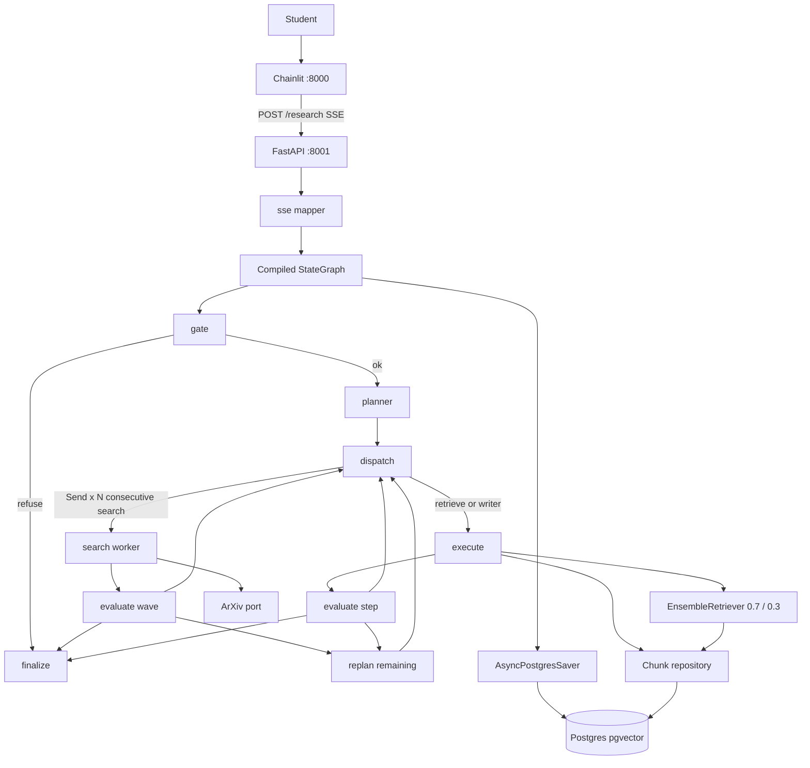
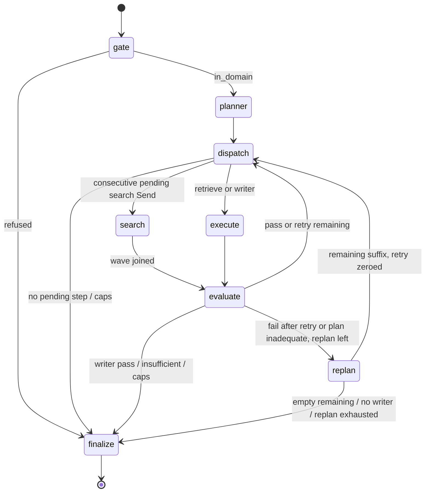

# Orchestrator Semantic Eval and Remaining-Plan Replan Design

**Spec**: `.specs/features/orchestrator-eval-replan/spec.md`  
**Parent design**: `.specs/features/arxiv-grounded-research/design.md` (approved; still the HTTP/SSE/checkpointer/pgvector baseline)  
**Architecture constraints**: `.specs/features/arxiv-grounded-research/context.md` (PAT-01–PAT-12 still apply)  
**Status**: Approved (2026-08-27)

---

## Architecture Overview

This feature does **not** add a second orchestrator. LangGraph remains the only loop (PAT-01). What changes is the **plan vocabulary** and the **interpreter**:

1. The Planner emits a variable-length list of `search` | `retrieve` | `writer` (no combined `researcher`, no `reuse_existing_papers` flag).
2. A **dispatch** node interprets that list: consecutive pending `search` steps fan out with LangGraph `Send`, then join; `retrieve` and `writer` stay sequential.
3. Eval is **semantic and artifact-specific**. Search eval is **one** structured LLM call per wave with **N independent verdicts**. Retrieve and writer stay one call each.
4. Retry is **per step** (1 retry = 2 attempts). Replan is **once per run**, remaining suffix only; passed steps and admitted papers stay.
5. PDF ingest + hybrid retrieve stay **inside** `retrieve` (not plan steps). Hybrid is LangChain `EnsembleRetriever` at **0.7 vector / 0.3 lexical (BM25)**.

HTTP, SSE event **names**, Chainlit, Gate, Writer grounding (ORCH-03), checkpointer, timeout, `max_steps=8`, and `max_papers=8` stay as in the parent design.





**Research notes (verification chain):**

- **Codebase:** v1 loop is `gate → planner → execute ↔ evaluate → finalize` in `graph/build.py`. Execute dispatches `plan[step_index].agent` via `AgentFactory`. `ResearcherRunner` still searches **and** loads PDFs **and** vector-only RAG in one step. `ResearchEvalStrategy` is allowlist/recency/non-empty only (no semantic judge). `Policy.max_retries_per_step = 2` is **two retries / three attempts**. `planner_prompt_abilities()` concatenates **all** registry entries (including `gate` / `planner`). Follow-up is `ResearchPlan.reuse_existing_papers`.
- **Project docs:** Parent design + PAT-01–PAT-12 + AD-010/AD-011. No `.specs/codebase/CONCERNS.md`. Fragile spots already in STATE: `dict_row` mapping, Windows event loop, `ChatOpenAI` needs explicit `api_key`.
- **LangGraph `Send`:** Conditional edge (or `Command.goto`) returns `[Send("search", worker_state), ...]`. Workers write a **reduced** key; after they join, a single downstream node runs. Documented map-reduce: [LangGraph Send / graph API](https://docs.langchain.com/oss/python/langgraph/graph-api).
- **`EnsembleRetriever`:** In this stack (`langchain>=1.3`) the class lives in **`langchain_classic`** (`EnsembleRetriever.ainvoke`, weighted **RRF**, `id_key` for identity). BM25 is `langchain_community.retrievers.BM25Retriever.from_documents`. Weights `[0.7, 0.3]` are RRF weights, **not** a linear mix of raw scores. That is the idiomatic LangChain hybrid the spec named; do not invent a second fusion.

---

## Code Reuse Analysis

### Existing Components to Leverage

| Component | Location | How to Use |
| --------- | -------- | ---------- |
| Plan interpreter loop | `graph/nodes/execute.py`, `evaluate.py`, `build.py` | Keep execute for **non-search** steps. Add `dispatch` + `search` worker + `replan`. Extend `_after_evaluate` with a `replan` target. |
| Agent registry + factory | `agents/registry.py`, `factory.py` | Replace `researcher` with `search` + `retrieve`. Planner prompt lists **plan agents only**. Dispatch still `factory.create(name).run(...)`. |
| Planner runner | `agents/planner.py` | Same `gpt-5.1` + structured `ResearchPlan`. Add a remaining-only prompt path. Drop `reuse_existing_papers`. Validate `agent ∈ {search, retrieve, writer}`. |
| Writer runner + ORCH-03 eval | `agents/writer.py`, `WriterEvalStrategy` | Unchanged grounding. Retry already honors `last_eval.feedback` and the same `evidence_chunks`. |
| Paper port / arXiv adapter | `ports/papers.py`, `adapters/arxiv.py`, `agents/tools.py` | Search uses `search` only. Retrieve uses `load_pdf_text` on cache miss. No new arXiv client. |
| Chunk repository + ingest | `repo/chunks.py`, `ports/chunks.py`, ingest loop in `researcher.py` | Move ingest into `RetrieveRunner`. Add `list_chunks(paper_keys)` for the BM25 corpus. Keep `similarity_search` for the vector retriever. |
| Policy allowlist / recency / splitter | `policy.py` | Search runner applies allowlist + recency (or `historical`). Splitter 500/100 unchanged. Change retry cap; add replan + hybrid weights. |
| SSE mapper + finalize | `api/sse.py`, `graph/nodes/finalize.py` | Same event names. Replan emits `plan`. Writer pass still `answer_complete` then `done`. Search `step_end` must **not** imply PDF (`pgvector: "n/a"`). |
| Gate, FastAPI lifespan, checkpointer | `graph/nodes/gate.py`, `main.py` | Unchanged compile-once (PAT-07). |
| Chainlit SSE client | `ui/app.py` | No new events. Optional: stop printing `Reuse existing papers.` when the field is gone. |

### Integration Points

| System | Integration Method |
| ------ | ------------------ |
| LangGraph | `Send` for search waves; `operator.add` / dict merge reducers for worker artifacts; `steps_executed` incremented **after join** (not per racing worker overwrite) |
| LangChain hybrid | `EnsembleRetriever` (vector 0.7 + BM25 0.3) **inside** retrieve adapter; graph nodes never see `Document` |
| pgvector | Same `papers` / `chunks` tables. New `list_chunks` SELECT, same `(arxiv_id, version)` IN-filter |
| SSE | Existing `plan` / `eval` / `step_*`. Wave eval: **N `eval` frames from one LLM call** (one per verdict) |
| Checkpointer | New state keys must `.get()`-default so old `thread_id`s still resume (papers on the thread remain for follow-up) |

No `CONCERNS.md`. Mitigations for known fragility: never index `dict_row` by `0`; keep `api_key` on every `ChatOpenAI`; `list_chunks` must use column names.

---

## Components

### Policy (PAT-10)

- **Purpose**: Single copy of caps, hybrid weights, retrieve `k`, allowlist, recency, splitter, grounding.
- **Location**: `src/plan_based_researcher/policy.py`
- **Interfaces**:
  - `Policy.max_retries_per_step: int = 1` — **1 retry = 2 attempts** (same increment-then-`>` logic as today, new cap)
  - `Policy.max_replans: int = 1`
  - `Policy.max_steps`, `max_papers`, `recency_years`, `chunk_size`, `chunk_overlap` — unchanged
  - `Policy.hybrid_vector_weight = 0.7`, `hybrid_lexical_weight = 0.3`
  - `Policy.retrieve_k = 8` (today’s `_RETRIEVE_K`)
- **Dependencies**: none new
- **Reuses**: existing `is_allowlisted` / `within_recency`

### Agent registry + factory (PAT-02, PLAN-02)

- **Purpose**: One roster for planner abilities **and** dispatch.
- **Location**: `agents/registry.py`, `factory.py`
- **Interfaces**:
  - `Role = Literal["gate", "planner", "search", "retrieve", "writer"]`
  - `PLAN_AGENTS: frozenset[str] = {"search", "retrieve", "writer"}`
  - `planner_prompt_abilities()` — **only** `PLAN_AGENTS` (not gate/planner)
  - `REGISTRY["search"]` — arXiv titles+abstracts; no PDF; `tools=("arxiv_search",)`; `gpt-5-mini`
  - `REGISTRY["retrieve"]` — ingest miss + hybrid over **admitted** papers; `tools=("arxiv_load",)`; `gpt-5-mini` (English retry rewrite)
  - `REGISTRY["writer"]` — unchanged
  - Remove `researcher` from `REGISTRY` and `AgentFactory`
  - `AgentFactory.create(name)` still a dict lookup
- **Dependencies**: new runners below
- **Reuses**: PAT-02 factory pattern

### Search runner (SEARCH-01)

- **Purpose**: One arXiv search for **this** step’s `task`. No PDF, no chunks, **no write to `papers`**.
- **Location**: `src/plan_based_researcher/agents/search.py`
- **Interfaces**:
  - `SearchRunner.run(state) -> dict` — returns `search_artifacts: {step_index: SearchArtifact}`
  - On retry: build a **new** arXiv query from `task` + that step’s eval `feedback` (`gpt-5-mini` structured rewrite; first attempt uses `task` as-is)
  - Apply allowlist + recency (or `historical`) before storing hits; respect remaining `max_papers` room only at **admission** time (eval), not by mutating `papers` here
- **Dependencies**: `PaperPort`, planner `task` / `historical`, eval feedback
- **Reuses**: `ArxivPaperAdapter.search`; filter helpers in today’s `ResearcherRunner`

### Retrieve runner (RETR-01)

- **Purpose**: Ensure admitted papers are ingested; hybrid-retrieve `[n]` chunks for **this** retrieve `task`.
- **Location**: `src/plan_based_researcher/agents/retrieve.py`
- **Interfaces**:
  - `RetrieveRunner.run(state) -> dict` — `evidence_chunks` numbered `[1…]`, `pgvector: "hit"|"miss"`, `last_agent: "retrieve"`
  - Cache miss → `load_pdf_text` → split 500/100 → embed → upsert (move loop from `researcher.py`)
  - Empty/unusable PDF → skip that paper (parent behavior)
  - First attempt: retrieval query = step `task`
  - Retry: rewrite retrieval query **in English** (`gpt-5-mini`) from task + feedback; **same** admitted paper set
  - Call hybrid port; do not search arXiv
- **Dependencies**: `PaperPort`, `ChunkRepository`, `EmbeddingPort`, hybrid adapter
- **Reuses**: ingest + numbering from `ResearcherRunner`; Writer still consumes `evidence_chunks`

### Hybrid retrieve adapter (RETR-01)

- **Purpose**: LangChain `EnsembleRetriever` over **admitted papers only**, without leaking retriever types into graph nodes.
- **Location**: `src/plan_based_researcher/adapters/hybrid.py`
- **Interfaces**:
  - `HybridRetrievePort.retrieve(query: str, paper_keys: list[tuple[str, str]], k: int) -> list[EvidenceChunk]` (async)
  - Vector leg: `BaseRetriever` wrapping `ChunkRepository.similarity_search` (existing SQL)
  - Lexical leg: `BM25Retriever.from_documents` on `list_chunks(paper_keys)`
  - `EnsembleRetriever(retrievers=[vector, bm25], weights=[0.7, 0.3], id_key="chunk_id")`
  - `ainvoke(query)`; map `Document` metadata back to `EvidenceChunk`
- **Dependencies**: `langchain-classic`, `langchain-community` BM25, `rank-bm25`
- **Reuses**: pgvector similarity SQL; PAT-08 (LangChain stays in adapters)

Empty `paper_keys` → `[]` (no retriever build).

### Chunk repository addition (PAT-09)

- **Purpose**: BM25 needs the admitted-paper corpus, not only top-k vectors.
- **Location**: `ports/chunks.py`, `repo/chunks.py`
- **Interfaces**:
  - `list_chunks(paper_keys: list[tuple[str, str]]) -> list[EvidenceChunk]`
- **Dependencies**: same pool, `dict_row` column names
- **Reuses**: join `chunks` + `papers` like `similarity_search`, `ORDER BY arxiv_id, version, chunk_index`

### Planner + replan node (PLAN-02, REPLAN-01, REPLAN-02)

- **Purpose**: Initial plan, then at most one remaining-suffix rewrite.
- **Location**: `agents/planner.py`, `graph/nodes/planner.py`, new `graph/nodes/replan.py`
- **Interfaces**:
  - Initial: typical shapes in the prompt — explain `search → retrieve → writer`; compare `search` × N distinct tasks → `retrieve` → `writer`; same-thread follow-up with papers already on state → `retrieve → writer` (omit `search`)
  - `ReplanInput`: student query, **committed prefix** (passed steps + short artifact summary), **admitted papers**, failed step(s) + feedback, leftover unpassed steps
  - Output: `ResearchPlan.steps` = **suffix only**. Graph concatenates `committed_prefix + suffix`. SSE `plan` data = **suffix only**
  - After parse: every `agent` in `PLAN_AGENTS`; if suffix empty or has no `writer` → `outcome=insufficient` (no student answer)
  - Zero `retry_counts` for indices `>= len(prefix)`; set `step_index = len(prefix)`; `replan_used = True`
- **Dependencies**: same `gpt-5.1` structured output
- **Reuses**: `planner_prompt_abilities()`, `get_stream_writer` `plan` event

Drop `ResearchPlan.reuse_existing_papers` (THR-02 mechanism superseded). Follow-up is encoded by **omitting** `search`.

### Dispatch + search worker (LOOP-01, SEARCH-01)

- **Purpose**: Interpret the list. Fan out independent searches. Never pick agents as a supervisor LLM.
- **Location**: `graph/nodes/dispatch.py`, `graph/nodes/search.py` (thin SSE + `SearchRunner`)
- **Interfaces**:
  - `search_wave_indices(state) -> list[int]` — from the first **unpassed** index, take a run of `agent=="search"` that are not in `passed_steps`
  - If that list is non-empty: `Command(goto=[Send("search", worker_input(i)), ...])`
  - Else if pending step is `retrieve`/`writer`: `Command(goto="execute")`
  - Else / caps: `Command(goto="finalize")`
  - Do **not** start a search wave if `steps_executed + len(wave) > Policy.max_steps` → `insufficient`
  - Worker emits `step_start` / `step_end` with `paper_ids` from **this** artifact and `pgvector: "n/a"`
- **Dependencies**: factory `search` runner
- **Reuses**: current `execute.py` SSE shape; LangGraph `Send` as documented

`execute` stays for retrieve/writer: `factory.create(plan[step_index].agent).run(state)` (PAT-04). Unknown agent → `outcome=error`.

### Eval types + strategies (PAT-05, LOOP-02, LOOP-03, SEARCH-02, RETR-01, WRITE-01)

- **Purpose**: Business outcomes as result objects; checklists from Policy, not a second prose spec.
- **Location**: `eval/types.py`, `eval/strategies.py` (replace `ResearchEvalStrategy`)
- **Interfaces**:

```python
class EvalResult(BaseModel):
    status: Literal["pass", "retry", "fail"]
    feedback: str
    plan_inadequate: bool = False

class SearchStepVerdict(BaseModel):
    step_index: int
    passed: bool
    plan_inadequate: bool = False
    feedback: str

class SearchWaveJudgement(BaseModel):
    verdicts: list[SearchStepVerdict]
    reasoning: str
```

  - **SearchEvalStrategy.evaluate_wave(state)**:
    1. Deterministic per artifact: empty hits / none allowlisted / none in recency → `passed=False` (still included in the **one** LLM call so the judge can set `plan_inadequate`, e.g. no papers for a named topic).
    2. **One** `gpt-5-mini` `with_structured_output(SearchWaveJudgement)` over **all** artifacts in this wave (retry wave = only indices still retrying).
    3. Map each verdict: `passed` → pass + admit hits into `papers` (reducer, plan order, trim `max_papers`); else if `plan_inadequate` → treat as replan trigger (**skip leftover retry**); else if `retry_counts[i] + 1 > max_retries_per_step` → fail that step; else retry that step.
  - **RetrieveEvalStrategy**: deterministic empty / chunks not from admitted keys → retry/fail; then one semantic judge vs **this** retrieve `task` (numbered `[n]`, admitted papers only).
  - **WriterEvalStrategy**: keep ORCH-03 deterministic `[n]` + no extra URLs, then language/tone judge. Retry = rewrite on **same** `evidence_chunks`. `plan_inadequate` is allowed but rare.
- **Dependencies**: Policy checklists; mini model; `api_key` on construct
- **Reuses**: existing writer deterministic checks; structured-output judge pattern

SSE: existing `eval` event. For a wave, emit **one `eval` frame per verdict** (`status`, `feedback`, `agent: "search"`, plus additive `step_index`, `plan_inadequate`). No new event name.

### Evaluate node (LOOP-01–03, CAP-02)

- **Purpose**: Apply verdicts, advance `passed_steps`, retry, replan, or halt.
- **Location**: `graph/nodes/evaluate.py`
- **Interfaces**:
  - If last hop was a search wave → `SearchEvalStrategy.evaluate_wave`; `steps_executed += len(wave)` here (single writer, no parallel clobber)
  - Else → strategy from `plan[step_index].agent` (`retrieve` / `writer`); `steps_executed` already +1 from execute
  - **Pass:** add index to `passed_steps`; do not re-execute it; `retry_counts[i]` unused thereafter
  - **Retry:** same indices stay unpassed; increment that index’s `retry_counts`
  - **Replan** if (any fail with retry exhausted **or** any `plan_inadequate`) **and** `not replan_used`
  - **Insufficient** if replan already used, or retry+replan exhausted, or `max_steps` hit, or plan ended without writer pass
  - Writer pass → `outcome=done` (finalize emits `answer_complete`)
  - Mixed wave (e.g. search 0,2 pass, 1 fail): admit 0 and 2; retry or replan **from the earliest unpassed index**; later passed searches are **not** redone; their papers stay
- **Dependencies**: strategies, Policy
- **Reuses**: current `eval` SSE + outcome routing, extended with `replan`

### Graph build (PAT-01, PAT-06, PAT-07)

- **Purpose**: Compile once; new nodes only.
- **Location**: `graph/build.py`, `graph/state.py`
- **Interfaces**:
  - Nodes: `gate`, `planner`, `dispatch`, `search`, `execute`, `evaluate`, `replan`, `finalize`
  - `GraphDeps`: factory + search/retrieve/writer eval strategies (drop `ResearchEvalStrategy`)
- **Dependencies**: LangGraph `Send`, `Command` (dispatch routing)
- **Reuses**: parent compile-once + checkpointer

---

## Data Models

### Plan (PLAN-02)

```python
class PlanStep(BaseModel):
    agent: str  # must be in PLAN_AGENTS after parse
    task: str
    reasoning: str
    historical: bool = False

class ResearchPlan(BaseModel):
    steps: list[PlanStep]
    # reuse_existing_papers removed
```

### Search artifact (not admitted until eval pass)

```python
class SearchHit(TypedDict):
    arxiv_id: str
    version: str
    title: str
    year: int
    url: str
    categories: list[str]
    abstract: str

class SearchArtifact(TypedDict):
    step_index: int
    query_used: str
    hits: list[SearchHit]
```

Admission on pass: map hits → `PaperRef` (no abstract required on `papers`) and return `{"papers": refs}` so `merge_papers` unions and trims `max_papers`. Failed searches never admit.

### Graph state (PAT-06)

Overwrite scalars unless annotated. New keys default via `.get` for old checkpoints.

```python
class GraphState(TypedDict):
    query: str
    messages: Annotated[list, add_messages]
    papers: Annotated[list[PaperRef], merge_papers]  # admitted only
    plan: list[dict]  # committed prefix + current suffix
    step_index: int  # first unpassed index (hint; passed_steps is source of truth)
    passed_steps: list[int]
    retry_counts: dict[str, int]  # JSON-safe keys: str(step_index)
    retry_count: int  # mirror of the active step, for traces
    replan_used: bool
    steps_executed: int
    search_artifacts: dict[str, SearchArtifact]  # merge by key, last write wins
    last_agent: str
    last_eval: dict
    evidence_chunks: list[EvidenceChunk]
    writer_markdown: str
    citations: list[dict]
    outcome: Literal["pending", "refused", "done", "insufficient", "error"]
    gate: dict
    error_message: str
```

Remove reliance on `reuse_existing_papers` for control flow (key may linger unused on old checkpoints).

**Relationships:** `papers` = thread-admitted set (checkpointed). `search_artifacts` = current-wave pending hits. `evidence_chunks` = this retrieve’s `[n]` list for Writer. `passed_steps` ⊆ plan indices never sent to execute/search again.

### Reducer: search artifacts

```python
def merge_search_artifacts(
    existing: dict[str, SearchArtifact] | None,
    new: dict[str, SearchArtifact] | None,
) -> dict[str, SearchArtifact]:
    return {**(existing or {}), **(new or {})}
```

Retry overwrites the same `step_index` key. Do **not** use `operator.add` on a list of artifacts (stale hits would accumulate).

`steps_executed`: keep as a plain int. **Only evaluate (wave) and execute (single step) increment it.** Search workers must not return `steps_executed` (parallel last-write-wins would under-count).

---

## Control flow (normative)

```text
dispatch:
  if outcome not pending → finalize
  if steps_executed >= max_steps → insufficient → finalize
  wave = consecutive unpassed search indices from first unpassed
  if wave:
        if steps_executed + len(wave) > max_steps → insufficient
        else Send search workers for wave
  else execute plan[first_unpassed]   # retrieve | writer
  if no unpassed steps and writer has not passed → insufficient

after search workers join → evaluate_wave
after execute → evaluate_step

evaluate:
  pass → mark passed; if writer → done; else dispatch
  fail and not plan_inadequate and retries left → dispatch (same indices)
  fail and (retry exhausted or plan_inadequate) and not replan_used → replan
  else → insufficient

replan:
  planner suffix only → emit plan SSE → dispatch
```

**Compare example (REPLAN-02):** plan `[search LoRA, search QLoRA, search DoRA, retrieve, writer]`. First two searches pass (papers admitted). DoRA fails twice. Replan suffix ≈ `retrieve` + `writer` tasked to compare LoRA vs QLoRA and state DoRA **without** evidence. Do **not** execute a Writer still asked to compare three as evidenced. Passed searches are not run again.

---

## Error Handling Strategy

| Error scenario | Handling | User impact |
| -------------- | -------- | ----------- |
| Gate refuse | Unchanged; no planner/loop | `gate` + `done` |
| Planner emits non-plan agent | Reject parse → `error` or replan feedback on **initial** plan only (no silent `researcher`) | `error` / retry plan once is **not** the run replan; initial planner failure is infra/`error` |
| Search empty / off-task | Semantic fail; retry = new arXiv query; no PDF | Extra `eval` + `step_*` |
| Search retry exhausted / plan inadequate | Remaining replan if unused; else `insufficient` | New `plan` SSE or `insufficient` |
| Second exhaustion after replan | `insufficient`; no `answer_complete` | Trace only |
| Retrieve empty / off-task | Retry English query; then replan Writer `task` if needed | Same events |
| PDF unusable | Paper contributes no chunks | May fail retrieve eval |
| `max_papers` already 8 | Later passing searches admit nothing new | Retrieve/Writer use admitted set |
| Wave would exceed `max_steps` | Do not Send; `insufficient` | No silent dropped topic |
| Timeout mid-retry/replan | API `wait_for` → `insufficient`/`error`; close SSE | No uncited answer |
| Remaining empty / no writer | `insufficient` | No student answer |
| Unknown `thread_id` | Empty checkpoint; new plan | First-turn research |
| Infra (DB/OpenAI) | Exception → SSE `error` | Not an eval status |

---

## SSE contract (unchanged names)

| `event` | This feature |
| ------- | ------------ |
| `plan` | Initial full step list; on replan, **remaining suffix only** |
| `step_start` / `step_end` | Per search worker and per retrieve/writer. Search: `paper_ids`, `pgvector: "n/a"` |
| `eval` | Per step verdict (N frames after one search-wave LLM call). Additive fields `step_index`, `plan_inadequate` allowed |
| `answer_complete` | Writer eval **pass** only |
| `insufficient` / `error` / `done` | Unchanged meanings |

No `replan` event. No `answer_delta`.

---

## Tech Decisions (non-obvious)

| Decision | Choice | Rationale |
| -------- | ------ | --------- |
| Fan-out | LangGraph `Send` + join at `evaluate` | Spec requires one wave; documented map-reduce; not N sequential searches |
| Search vs papers | Artifacts first; admit on **pass** only | Failed search must not pollute retrieve |
| Wave eval | One structured call, N verdicts; N SSE `eval` frames | SEARCH-02; UI still uses existing event name |
| Parallel `steps_executed` | Increment in evaluate after join | Avoid last-write-wins under-count |
| Retry cap | `max_retries_per_step = 1` keeping `count > cap` | Same code shape as v1; 2 attempts total |
| Plan-inadequate vs retry | `plan_inadequate` skips leftover retry | Spec edge case; PAT-05 result object, not an exception |
| Replan state | `plan = prefix_passed + new_suffix`; SSE shows suffix | Passed work stays executable-history; student sees what is left |
| Mixed wave pass/fail | Earliest unpassed is the remaining head; later **passed** searches stay in `passed_steps` | Never redo passed work; papers stay |
| Follow-up | Omit `search` in the plan; drop `reuse_existing_papers` | THR-02 mechanism superseded; papers already on checkpoint |
| Planner prompt roster | `PLAN_AGENTS` only | Stops planner from scheduling `gate`/`planner` |
| Hybrid | `EnsembleRetriever` RRF weights 0.7/0.3 + `id_key=chunk_id` | Spec-mandated LangChain ensemble; RRF is what that class implements |
| BM25 corpus | `list_chunks` then in-memory BM25 | ≤8 papers; no library-wide lexical search |
| New deps | Direct `langchain-classic`, `rank-bm25` | Ensemble import path in LangChain 1.3; BM25 extra |
| Dispatch routing | `Command.goto` with `Send` list or `"execute"` | One interpreter node; no supervisor LLM |
| Search retry query | Mini-model rewrite from task+feedback | Spec wants a **new** arXiv query; concat-only is weaker |
| Retrieve retry query | Mini-model **English** rewrite | Spec-locked; first attempt may stay in student language |
| Wave vs `max_steps` | Refuse to start an oversized wave | Do not silently drop a compare topic |

---

## Package layout (delta)

```
src/plan_based_researcher/
  agents/{registry, factory, planner, search, retrieve, writer}  # researcher.py removed
  adapters/hybrid.py                                             # new
  graph/nodes/{dispatch, search, replan, execute, evaluate, ...}
  eval/{types, strategies}
  ports/chunks.py                                                # + list_chunks
  repo/chunks.py
```

---

## New / removed dependencies (implement phase)

**Add (direct):** `langchain-classic` (EnsembleRetriever), `rank-bm25` (BM25Retriever).

**Remove:** combined `researcher` agent (code), `ResearchPlan.reuse_existing_papers`, `ResearchEvalStrategy`.

Do **not** add Elasticsearch / a second vector store.

---

## Requirement mapping (design coverage)

| ID | Design coverage |
| -- | --------------- |
| PLAN-02 | Registry `PLAN_AGENTS`, planner shapes, factory dispatch |
| LOOP-01 | `dispatch` interprets list; `Send` / `execute`; no supervisor |
| LOOP-02 | Per-index `retry_counts`; cap 1; pass marks `passed_steps` |
| LOOP-03 | `plan_inadequate` or retry exhausted → `replan` or `insufficient` |
| SEARCH-01 | `SearchRunner`; no PDF; admit on pass; `Send` wave |
| SEARCH-02 | `SearchEvalStrategy.evaluate_wave` one LLM / N verdicts |
| RETR-01 | `RetrieveRunner` + `adapters/hybrid.py` 0.7/0.3; English retry |
| WRITE-01 | Existing writer + ORCH-03; `answer_complete` only on pass |
| REPLAN-01 | `replan` node; suffix only; one shot; zero retries on new head |
| REPLAN-02 | Replan prompt includes evidenced vs missing topics |
| CAP-02 | Policy caps; wave vs `max_steps`; timeout unchanged in API |

**Coverage:** 11/11 IDs have a component and data shape.

---

## Out of design (still deferred / parent-locked)

New SSE names, Chainlit replan widgets, HITL, web search, global corpus RAG, `answer_delta`, rewriting passed steps, hexagonal HTTP adapters.

---

## Confirm before Tasks

This design is **Draft**. Please approve or correct:

1. `Send` waves + one search-wave judge (N verdicts).
2. Admit papers only after search eval pass.
3. `EnsembleRetriever` RRF at 0.7/0.3 (not linear score fusion).
4. Drop `reuse_existing_papers` in favor of `retrieve → writer` plans.
5. `max_retries_per_step = 1` (2 attempts) and `max_replans = 1`.
