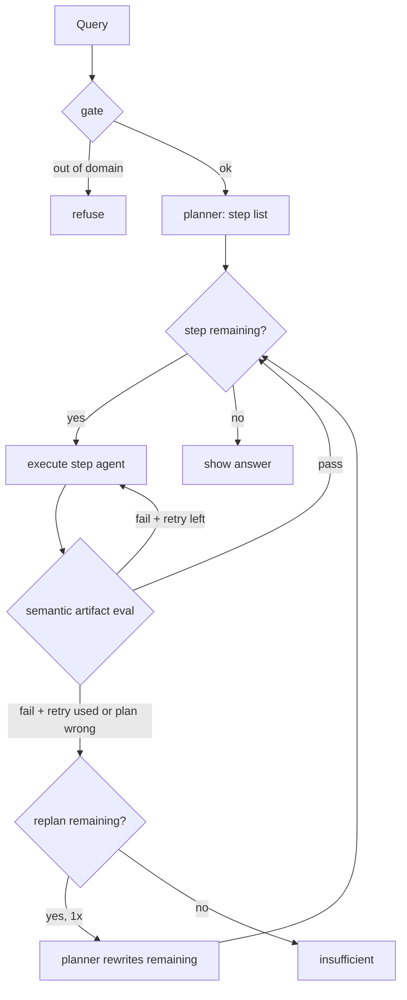

# Orchestrator Semantic Eval and Remaining-Plan Replan Specification

**Feature:** `orchestrator-eval-replan`  
**Spec status:** Approved (2026-08-27)  
**Date:** 2026-08-27  
**Parent:** `.specs/features/arxiv-grounded-research/spec.md` (approved v1)  
**Architecture constraints:** `.specs/features/arxiv-grounded-research/context.md` (PAT-01–PAT-12 still apply)  
**Design:** `.specs/features/orchestrator-eval-replan/design.md` (approved 2026-08-27)

This spec defines **only** the new orchestrator loop, plan shape, per-artifact eval, retry, and replan. Gate, arXiv allowlist, grounding format, SSE event **names**, Chainlit, checkpointer, models, splitter sizes, `max_papers`, and timeout stay as in the parent spec unless an ID below explicitly supersedes them.

## Problem Statement

The v1 loop treats research as one `researcher` step and retries until `max_retries_per_step` then stops. Eval can pass because “something ran,” and a bad decomposition (for example one missing comparison topic) still pushes the Writer to answer the original question. Students then get either a premature `insufficient` or a comparison that pretends three topics were evidenced. The orchestrator must **interpret** a variable plan, judge each **artifact** against **that step’s task**, allow **one retry** (two attempts) on the same step, and — if that is not enough or the **plan** is wrong — **replan only the remaining steps** once.

## Goals

- A student query produces a variable plan of `search` / `retrieve` / `writer` steps; the orchestrator executes that list and does not pick agents ad hoc.
- Each step is accepted only when its artifact is correct for **that** task (semantic eval), not merely because the agent returned.
- One retry per step (two attempts total) with feedback; one remaining-only replan per run; then `insufficient`. Passed steps are never redone.

## Out of Scope

Explicitly excluded. Documented to prevent scope creep.


| Feature                                                                      | Reason                                                           |
| ---------------------------------------------------------------------------- | ---------------------------------------------------------------- |
| New SSE event names (`replan`, `answer_delta`, …)                            | Reuse existing `plan` + `eval`; parent SSE-01 vocabulary         |
| Chainlit-specific replan UI / extra widgets                                  | Existing `plan` / `eval` / `step_*` rendering is enough          |
| Rewriting or re-executing steps that already passed eval                     | User lock: what passed stays                                     |
| More than 1 retry per step, or more than 1 replan per run                    | Caps are 1 and 1                                                 |
| Combining search + PDF + RAG into a single plan step (`researcher`)          | Plan steps are `search`, `retrieve`, `writer`                    |
| Changing Gate, allowlist, citation `[n]` contract, `answer_complete` payload | Parent spec                                                      |
| HITL plan approval, web search, global corpus RAG                            | Already out of v1                                                |
| Inventing extra agents, extra eval checklists, or extra plan types           | This spec lists the three step kinds and the typical plans below |


### Supersedes (parent spec)

Upon approval, these parent IDs are **replaced** by this feature (do not implement both):


| Parent ID            | What no longer holds                                                                                                                                                                               |
| -------------------- | -------------------------------------------------------------------------------------------------------------------------------------------------------------------------------------------------- |
| ORCH-01              | Retry-or-advance only; no remaining-plan replan                                                                                                                                                    |
| ORCH-02              | Single researcher eval (papers exist / allowlist / recency only)                                                                                                                                   |
| CAP-01 (retry count) | `max_retries_per_step=2` as **two retries** (three attempts in current code). **Unchanged:** `max_steps=8`, `max_papers=8`, timeout ~2 min, cap hit → `insufficient`/`error`, no fabricated answer |
| PLAN-01 (agent set)  | Plan may name a combined `researcher`. **Unchanged:** ordered `{ agent, task, reasoning }`, historical flag, planner from registry abilities                                                       |
| THR-02 (mechanism)   | Follow-up via `reuse_existing_papers` on a researcher step. **Unchanged:** same-topic follow-up must not search arXiv again                                                                        |


Parent ORCH-03 (Writer checklist), GATE-*, ARX-*, GROUND-*, SSE event **names**, UI-* remain in force.

---

## User Stories

### P1: Variable plan the orchestrator interprets ⭐ MVP

**User Story**: As a student, I want the system to build a plan sized to my question (one topic vs several vs a follow-up) so that search, retrieval, and writing are separate steps I can see, not one opaque research blob.

**Why P1**: Without a variable `search` / `retrieve` / `writer` list, semantic eval and remaining-only replan have nothing correct to interpret.

**Acceptance Criteria**:

1. WHEN the Gate allows the query THEN the Planner SHALL emit an ordered list of steps `{ agent, task, reasoning }` (historical flag unchanged) whose `agent` values are only `search`, `retrieve`, or `writer` (plus whatever the registry already requires for dispatch). The Orchestrator SHALL **interpret** that list: execute `plan[i]`, then eval, then advance, retry, replan, or stop. It SHALL NOT use a free-form supervisor to pick the next agent.
2. WHEN the query is a single-topic explanation (e.g. “Explique LoRA”) THEN the typical plan SHALL be `search` → `retrieve` → `writer` (one search task for that topic).
3. WHEN the query compares several named methods (e.g. “Compare LoRA / QLoRA / DoRA…”) THEN the typical plan SHALL be one `search` step **per distinct topic** (distinct `task` texts) → one `retrieve` → one `writer`. Consecutive independent `search` steps SHALL be allowed to execute as one fan-out wave (`Send`); `retrieve` and `writer` SHALL stay sequential after the wave joins.
4. WHEN the request is a same-thread follow-up that can be answered from papers already admitted on that thread THEN the typical plan SHALL be `retrieve` → `writer` and SHALL omit `search` (no new arXiv search).
5. WHEN a `search` step runs THEN it SHALL search arXiv (titles + abstracts), apply allowlist and recency (or historical), and SHALL NOT download or parse PDFs. Papers from a search that **passes** eval are admitted for later `retrieve`; papers from a search that does not pass are not admitted.
6. WHEN a `retrieve` step runs THEN it SHALL return numbered chunks `[n]` **only** from papers that already passed a `search` eval (or were already admitted on the thread for a follow-up with no new search). PDF ingest stays **under the hood, not a plan step**: cache miss → load PDF → split 500/100 → embed → hybrid retrieve **0.7 vector / 0.3 lexical** -> USE EMSAMBLE RETRIEVER FROM LANGCHAIN, still filtered to those papers (not the whole library).
7. WHEN the Planner prompt is built THEN it SHALL describe `search`, `retrieve`, and `writer` abilities from the same registry the Orchestrator uses to dispatch (no second copy of the roster).

**Independent Test**: In-domain “Explique LoRA” on a new `thread_id`: SSE `plan` lists `search`, `retrieve`, `writer` in that order; `step_start`/`step_end` for search show paper ids and no PDF requirement; retrieve then writer; `answer_complete` only after writer eval pass. Compare query: three distinct `search` tasks before `retrieve`. Follow-up on the same thread: `plan` is `retrieve` then `writer` (no `search`).

---

### P1: Semantic artifact eval and one retry per step

**User Story**: As a student, I want each step judged on whether its output matches **that** task so that a bad search is retried with a new query, not waved through, and a bad draft is rewritten on the same evidence.

**Why P1**: This is the difference between “the tool returned” and a grounded answer.

**Acceptance Criteria**:

1. WHEN a step finishes THEN the Orchestrator SHALL evaluate that step’s **artifact** against **that step’s `task`** (semantic, not only non-empty output). Checklists below are normative and **do not change** when a replan rewrites the remaining list (only the list changes).
2. WHEN eval **passes** THEN the system SHALL reset that step’s retry counter and SHALL advance to the next step in the current plan. It SHALL NOT re-execute steps that already passed.
3. WHEN eval **fails** and this step has not yet used its one retry THEN the system SHALL execute the **same** step again with eval **feedback** (two attempts total: first try + one retry). `eval` SSE SHALL reflect retry (existing `eval` event; no new event name).
4. WHEN the step is `search` THEN eval SHALL require titles + abstracts to match **this** task, plus allowlist and recency (or historical). Retry SHALL be a **new arXiv query**, not a PDF fetch. Eval SHALL NOT require PDFs or chunks.
5. WHEN one or more `search` steps in the same wave have returned (each: titles + abstracts from arXiv) THEN the semantic judge SHALL be **one** LLM call with structured output over **all** of those returns together. The structured output SHALL contain **one independent verdict (yes or no) + feedback per search step** (not one pass/fail for the whole wave, and not one LLM call per return) + reasoning. A single-topic plan (N=1) uses the same path: one call, one verdict. A retry wave SHALL be one call over only the searches still being retried. Allowlist / recency / empty-hit checks MAY run without an LLM before that call.
6. WHEN the step is `retrieve` THEN eval SHALL require numbered chunks `[n]` drawn only from already-admitted papers and aligned to **this** retrieve task. Retry SHALL **rewrite the retrieval query in English** (same paper set unless a later replan changes remaining steps).
7. WHEN the step is `writer` THEN eval SHALL keep parent ORCH-03: student language, didactic tone, every technical claim cites a real `[n]`, no extra sources. Retry SHALL rewrite using the **same** evidence chunks (no new search/retrieve on retry). Replan triggered from Writer is rare; if the prose is fine and the **question** is stale, remaining steps SHOULD already have been replanned **before** Writer.
8. WHEN Writer eval **passes** THEN the system SHALL emit `answer_complete` (markdown + `citations[]`) and SHALL NOT emit `answer_delta`. The student-visible answer SHALL appear only then. WHEN the plan has no further steps and Writer has not passed THEN the system SHALL NOT emit `answer_complete`.

**Independent Test**: Force a search eval fail once (empty/off-task hits) then pass on retry: two search executes, then retrieve + writer. Force a writer eval fail once: second writer call uses the same `[n]` evidence; then `answer_complete`. Search retry must not load PDFs.

---

### P1: One remaining-only replan, then insufficient ⭐ MVP

**User Story**: As a student, I want the system to rewrite only what is left when a step cannot be saved by retry (or the plan itself is wrong), so that work that already passed is kept and I am not given a fake full comparison.

**Why P1**: Without remaining-only replan, a single missing topic either kills the run or the Writer invents coverage.

**Acceptance Criteria**:

1. WHEN eval fails and the step’s one retry is **already used**, OR WHEN eval concludes the **plan** is inadequate (decomposition cannot succeed — e.g. a search topic with no suitable papers; remaining Writer would still ask to compare three), THEN if this run has **not** yet used its one replan, the Planner SHALL rewrite **only the remaining suffix** (current failed step and everything after). Steps that already **passed** eval SHALL stay as-is and SHALL NOT be re-executed. Admitted papers from passed `search` steps SHALL remain.
2. WHEN that replan runs THEN the system SHALL emit the existing `plan` SSE event with the new remaining steps, SHALL set the current step to the first of that suffix, SHALL **zero** the retry counter for that new current step, and SHALL continue the same execute → eval loop. The eval checklists SHALL be unchanged.
3. WHEN replan is required but this run has **already** used its one replan, OR WHEN retry and replan are both exhausted, THEN the system SHALL emit `insufficient` (trace so far) and SHALL NOT invent claims to finish the answer.
4. WHEN a compare plan’s later `search` (e.g. DoRA) exhausts retries THEN a typical remaining plan SHALL be `retrieve` + `writer` tasked to compare the topics that **have** evidence and to state the missing topic **without** evidence (e.g. LoRA vs QLoRA; DoRA unevidenced). The Orchestrator SHALL NOT “just continue” into a Writer still asked to compare all three as if search had passed.
5. WHEN `retrieve` eval fails after retry (or eval says the paper set / question cut changed enough that later steps need a new task) THEN replan SHALL rewrite the remaining suffix (usually the Writer `task`), not secretly keep the old Writer task.
6. WHEN `max_steps=8` or the ~2 minute timeout is hit THEN the system SHALL stop with `insufficient` or `error` as in the parent spec. New steps introduced by replan **count** toward `max_steps` and toward the same timeout. The one retry per step and one replan per run apply **in addition** to those caps, not instead of them.

**Independent Test**: Plan with three searches; first two pass; third search fails twice; one `plan` event with remaining `retrieve` + `writer` whose writer task no longer requires the failed topic as evidenced; first two searches are not run again. A second failure after that replan → `insufficient`, no `answer_complete`.

---

## Edge Cases

- WHEN the Gate refuses THEN the run SHALL stop with no arXiv and no planner/orchestrator loop (parent GATE-01). Unchanged.
- WHEN eval fails, retry still available, and eval does **not** mark the plan inadequate THEN the system SHALL retry the same step and SHALL NOT replan yet.
- WHEN eval marks the plan inadequate while a retry remains THEN the system SHALL skip the leftover retry and SHALL replan remaining if the run still has its one replan; otherwise `insufficient`.
- WHEN replan remaining is empty, or contains no `writer`, and Writer has not passed THEN the system SHALL `insufficient` (no student answer).
- WHEN timeout fires mid-retry or mid-replan THEN the system SHALL `insufficient` or `error`, close SSE, and SHALL NOT complete an uncited answer.
- WHEN `max_papers=8` is already reached THEN later `search` steps SHALL not admit more unique papers; `retrieve` / Writer use the admitted set (parent ARX-04).
- WHEN PDF text is unusable on retrieve miss THEN that paper SHALL not contribute chunks; retrieve eval / retry / replan / `insufficient` follow this spec; Writer SHALL NOT cite empty chunks (parent).
- WHEN two chunks disagree THEN Writer SHALL state both with `[n]` (parent GROUND-03). Unchanged.
- WHEN the student query is not English THEN Gate/Planner/Writer-facing student text SHALL match that language; retrieve **retry** query is still rewritten in **English**; paper titles/abstracts/excerpts stay as sourced.
- WHEN N parallel searches complete THEN the system SHALL NOT issue N semantic-judge LLM calls. WHEN a retry wave has M remaining searches THEN it SHALL issue one judge call over those M returns.

---

## Constraints (locked for this feature)


| Area                                              | Decision                                                                                                                                                                  |
| ------------------------------------------------- | ------------------------------------------------------------------------------------------------------------------------------------------------------------------------- |
| Plan agents                                       | `search`, `retrieve`, `writer` as separate plan steps; orchestrator interprets the list (PAT-04)                                                                          |
| Eval                                              | Semantic, artifact- and task-specific; checklists below; not “agent returned”                                                                                             |
| Search-wave judge                                 | **One** LLM structured-output call per wave; **N independent verdicts** (one per search). Not N LLM calls. `retrieve` / `writer` eval stay one call each, after the wave. |
| Retry                                             | **1 retry per step = 2 attempts** on that step, with feedback                                                                                                             |
| Replan                                            | **1 replan per run**, remaining suffix only; retry counter zeroed on the new current step                                                                                 |
| Passed steps                                      | Never redone; admitted papers from passed searches kept                                                                                                                   |
| Exhaustion                                        | Retry and replan used up (or caps) → `insufficient`, no invented completion                                                                                               |
| Search retry                                      | New arXiv query; no PDF                                                                                                                                                   |
| Retrieve retry                                    | Rewrite retrieval query in English                                                                                                                                        |
| Writer retry                                      | Rewrite with the **same** evidence                                                                                                                                        |
| Retrieve internals (not in the plan)              | Miss → PDF → split 500/100 → hybrid **0.7 / 0.3** over admitted papers                                                                                                    |
| Caps still in force                               | `max_steps=8`, `max_papers=8`, timeout ~2 min, including steps added by replan                                                                                            |
| SSE                                               | Same event names as parent; replan reuses `plan`                                                                                                                          |
| Models, Gate, grounding `[n]`, Chainlit, Postgres | Parent spec / AD-006–AD-009                                                                                                                                               |


```text
query
  → gate (domain; if refuse, stop — no arXiv)
  → planner (variable-length plan)
  → for each step of the current plan:
        execute that step’s agent
        orchestrator evaluates the artifact (correct for the task, not only “it ran”)
        if pass → next step
        if fail and 1 retry still available → same step + feedback
        if fail, retry exhausted (or eval = “plan inadequate”)
              and 1 replan still available:
                    planner rewrites only the remaining suffix
                    zero retry on the new current step
                    continue the loop
              else → insufficient
  → only after Writer passes eval → student-visible answer
```




**Eval checklists (normative; replan does not change them):**

- `**search`** — titles + abstracts match **this** task; allowlist + recency (or historical). No PDF. Fail after retry or “this decomposition cannot work” → replan remaining (drop or replace later steps). Do not proceed to a Writer still tasked as if this search passed.
- `**retrieve`** — `[n]` chunks only from papers that already passed. Internals: miss → PDF → split → hybrid 0.7/0.3. Retry = English retrieval query. Replan = paper set or question cut changed enough that later steps (usually Writer) need a new `task`.
- `**writer`** — real `[n]`, student language, didactic tone, no extra sources. Retry = rewrite on the same evidence. Replan from Writer is rare. Pass → `answer_complete`.

---

## Requirement Traceability

Each requirement gets a unique ID for tracking across design, tasks, and validation.


| Requirement ID | Story                     | Phase | Status  |
| -------------- | ------------------------- | ----- | ------- |
| PLAN-02        | P1: Variable plan         | Tasks | Pending |
| LOOP-01        | P1: Semantic eval + retry | Tasks | Pending |
| LOOP-02        | P1: Semantic eval + retry | Tasks | Pending |
| LOOP-03        | P1: Replan remaining      | Tasks | Pending |
| SEARCH-01      | P1: Variable plan         | Tasks | Pending |
| SEARCH-02      | P1: Semantic eval + retry | Tasks | Pending |
| RETR-01        | P1: Variable plan         | Tasks | Pending |
| WRITE-01       | P1: Semantic eval + retry | Tasks | Pending |
| REPLAN-01      | P1: Replan remaining      | Tasks | Pending |
| REPLAN-02      | P1: Replan remaining      | Tasks | Pending |
| CAP-02         | P1: Replan remaining      | Tasks | Pending |


**ID map (normative behavior):**

- **PLAN-02** — Planner emits a variable-length plan of `search` / `retrieve` / `writer` only. Typical shapes: explain → `search` → `retrieve` → `writer`; compare → `search` × N (distinct tasks) → `retrieve` → `writer`; same-thread follow-up → `retrieve` → `writer` (omit `search`). Registry is the single source of abilities + dispatch.
- **LOOP-01** — Orchestrator **interprets** the plan: execute current step → semantic eval of **that** artifact against **that** `task` → pass advances; does not pick agents as a supervisor.
- **LOOP-02** — Fail + retry remaining → same step + feedback. **1 retry = 2 attempts** on that step. Pass zeros the retry counter for the next step.
- **LOOP-03** — Fail + retry exhausted **or** eval = plan inadequate → if replan remaining, else `insufficient`. Plan-inadequate skips any unused retry on that step.
- **SEARCH-01** — Search artifact is titles + abstracts for **this** task, allowlist/recency (or historical). No PDF. Retry = new arXiv query. Only passing searches admit papers. Consecutive independent searches may fan out (`Send`) and join before eval.
- **SEARCH-02** — Semantic search eval is **one** LLM structured-output call per wave, input = all title+abstract returns in that wave, output = one verdict + feedback **per search step**. Not one LLM call per return. Not one verdict for the whole wave. Retry wave: one call over the subset still retrying.
- **RETR-01** — Retrieve artifact is `[n]` chunks only from admitted papers. Under the hood (not a plan step): miss → PDF → split 500/100 → hybrid 0.7 vector / 0.3 lexical. Retry = rewrite retrieval query in English.
- **WRITE-01** — Writer eval remains ORCH-03. Retry = rewrite on the **same** evidence. Pass → `answer_complete` only; no student-visible answer before that.
- **REPLAN-01** — At most **one** replan per run. Planner rewrites **only** the remaining suffix. Passed steps and admitted papers stay. Emit existing `plan` event. Zero retry on the new current step. Checklists unchanged.
- **REPLAN-02** — Example: `search DoRA` retries exhausted → remaining `retrieve` + `writer` “compare LoRA vs QLoRA; DoRA without evidence.” Do not continue a Writer still asked to compare three as evidenced.
- **CAP-02** — Caps: 1 retry per step; 1 replan per run (on top of retries). Parent `max_steps=8`, `max_papers=8`, timeout ~2 min still apply to the **whole** run, **including** steps added by replan. Exhaustion or cap → `insufficient`/`error`, no fabricated completion.

**Coverage:** 11 total, 11 mapped in approved design; task mapping in `tasks.md` (draft pending approval).

---

## Success Criteria

- Explain / compare / follow-up queries produce the typical plan shapes above (visible in SSE `plan`).
- Search eval can fail a step whose hits do not match **that** task even if some papers were returned; retry is a new arXiv query without PDF.
- A failed compare-topic search, after retry, replans remaining once so Writer is not told to compare unevidenced topics as if they were found; passed searches are not rerun.
- A second exhaustion after that replan (or after retry+replan used) yields `insufficient`, never an uncited “complete” answer.
- Writer `answer_complete` only after Writer eval pass; student never sees a pre-eval answer.

